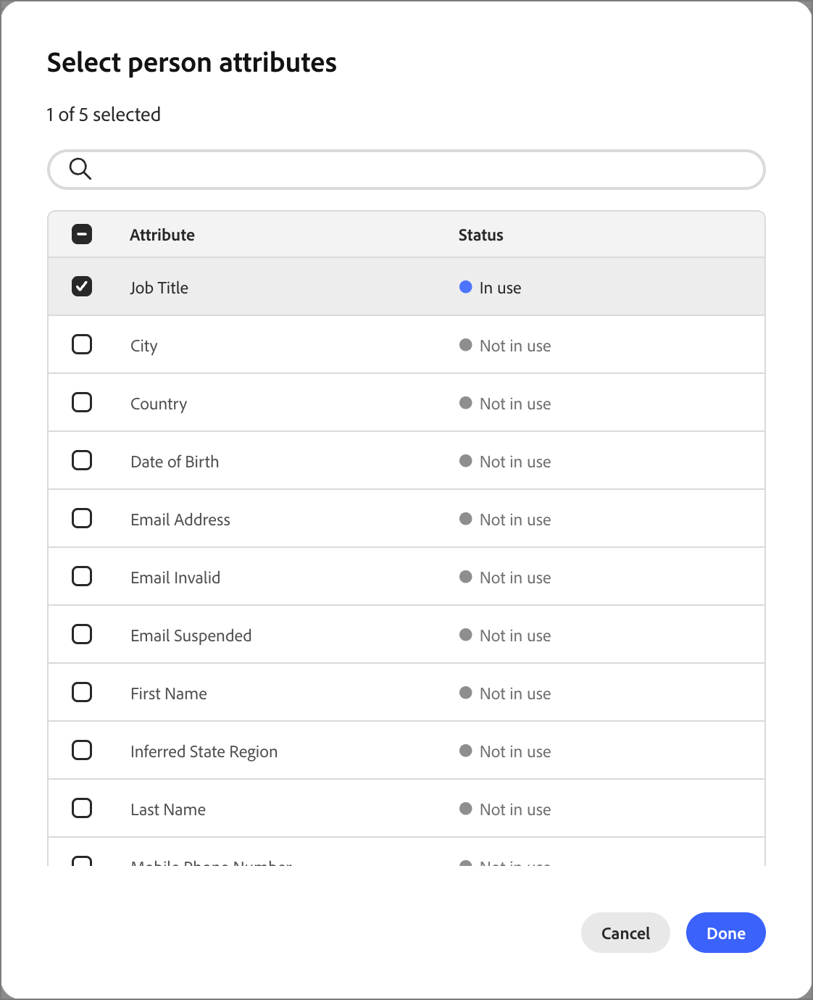

# ペルソナマッピング

<!-- not available until GA -->

ペルソナは、アカウントベースドマーケティング（ABM）アプローチの重要な側面です。マーケターが、ターゲットアカウント内の個人の特定のニーズ、好み、悩みに合わせて戦略を調整するのに役立ちます。 マーケターは、ペルソナの背景、責任、課題、好みのコミュニケーションチャネルなど、各ペルソナの詳細なプロファイルを作成できます。 管理者は、これらの定義により、Marketo Optimizerのユーザー属性に従ってペルソナを設定できるため、ユーザーリストとユーザージャーニーで、これらのペルソナをキャプチャする合理化された一貫したフィルタリングを使用できるようになります。

Marketo Optimizerでは、ペルソナマッピングにより、ロールテンプレートの条件を超える機能が追加されています。**[!UICONTROL 派生ペルソナ]**&#x200B;をフィルター基準として使用して、[人物リスト &#x200B;](../audiences/people-lists.md)および[人物ジャーニー](../marketing/person-journeys.md)をフィルタリングできます。 _派生ペルソナ_&#x200B;は、設定されたすべてのペルソナ定義に対して属性を評価することで、個人レコードに対して推測されるペルソナです。

ペルソナの定義と使用に関する制限：

* _[!UICONTROL ペルソナマッピング]_ リストで定義できるペルソナは、最大20個までです。
* 各ペルソナは、定義に最大5つの属性を含めることができます。
* 定義されたすべてのペルソナで、最大10個の異なる人物属性を使用できます。

>[!BEGINSHADEBOX]

**使用例：役職のバリエーション**

多くのマーケティング部門や営業部門は、アカウント内のさまざまなペルソナを識別する方法として役職を利用しています。 しかし、連絡先のタイトルには一貫性がなく、類似の役割に多数のバリエーションを使用する場合があります。 人物リストフィルターまたは人物ジャーニーのオーディエンス条件を作成する場合、特定の役割に関連するすべての役職を定義する必要がある場合があります。 これらの定義を簡素化し、類似した役職を持つ人物を1つの推定ペルソナの下に呼び出すことができます。その後、個々の役職名の値に一致するのではなく、_派生ペルソナは製品管理_&#x200B;でフィルタリングしてターゲットにすることができます。

>[!ENDSHADEBOX]

## 設定されたペルソナへのアクセス {#access}

1. 左側のナビゲーションで、**[!UICONTROL 管理]** > **[!UICONTROL 設定]**&#x200B;を選択します。

1. 中間パネルの&#x200B;**[!UICONTROL ペルソナマッピング]**&#x200B;をクリックして、ペルソナのリストを表示します。

   {width="800" zoomable="yes"}

   このページから、[作成](#create-a-persona)、[編集](#edit-a-persona)、または[削除](#delete-a-persona) ペルソナを作成できます。

   ペルソナマッピングリストはテーブルとして整理され、最も最近更新されたペルソナが上部に表示されます（_[!UICONTROL 最後の更新]_&#x200B;で並べ替え）。 右上隅の&#x200B;_列設定_ （）アイコンをクリックして、列のチェックボックスを選択またはクリアすると、表示されるテーブルをカスタマイズできます。

   {width="300"}

1. ペルソナの詳細にアクセスするには、名前をクリックします。

### デフォルトペルソナ

_ペルソナマッピング_ リストには、役職の属性に従って定義される5つのデフォルトのペルソナが含まれています。 組織のニーズに応じて、次のデフォルトペルソナのいずれかを編集できます。

| ペルソナ | 役職 |
| ------- | ---------- |
| CXO/EVP - CXO/エグゼクティブバイスプレジデント | CEO、CIO、CTO、CMO、CFO、戦略担当エグゼクティブバイスプレジデント |
| シニアバイスプレジデント/バイスプレジデント | マーケティング担当シニアバイスプレジデント、セールス担当バイスプレジデント、オペレーション担当シニアバイスプレジデント、製品担当バイスプレジデント、IT担当バイスプレジデント |
| シニアディレクター/ディレクター – シニアディレクター/ディレクター | エンジニアリング担当ディレクター、製品担当シニアディレクター、財務担当ディレクター、カスタマーサクセス担当ディレクター |
| シニアマネージャー/マネージャー – シニアマネージャー/マネージャー | シニアマーケティングマネージャー、IT マネージャー、オペレーションマネージャー、セールスマネージャー、人事マネージャー |
| 個々の貢献者 – 個々の貢献者 | アカウントエグゼクティブ，ソフトウェアエンジニア，マーケティングスペシャリスト，カスタマーサクセス担当者 |
| アナリスト – アナリスト | ビジネスアナリスト、データアナリスト、市場調査アナリスト、金融アナリスト、オペレーションアナリスト |
| 開発者 – 開発者 | フロントエンド開発者、バックエンド開発者、フルスタック開発者、モバイルアプリ開発者、DevOps エンジニア |
| プロフェッショナル スタッフ – プロフェッショナル スタッフ | 人事スペシャリスト，法務顧問，コンプライアンス担当者，プロジェクトマネージャー，調達スペシャリスト |
| コンサルタント – コンサルタント | 管理コンサルタント，IT コンサルタント，ビジネスプロセスコンサルタント，マーケティングコンサルタント |
| その他 – その他 | 業界スペシャリスト、独立系アドバイザー、フリーランスコンサルタント、SME エキスパート |

### フィルタリングのリスト

目的のペルソナを見つけるには、検索バーにテキスト文字列を入力して、名前でペルソナを一致させます。

{width="700" zoomable="yes"}

## ペルソナの作成 {#create-a-persona}

1. 左側のナビゲーションで **[!UICONTROL 管理]**/**[!UICONTROL 設定]** を選択します。

1. 中間パネルで「**[!UICONTROL ペルソナマッピング]**」をクリックします。

1. 「**[!UICONTROL ペルソナを作成]**」をクリックします。

1. ペルソナの一意の&#x200B;**[!UICONTROL 名前]**&#x200B;と&#x200B;**[!UICONTROL 説明]** （オプション）を入力します。

   {width="700" zoomable="yes"}

1. ペルソナのマッチングに使用する属性を選択します。

   * 「**[!UICONTROL 人物属性を選択]**」をクリックします。

   * ダイアログで、マッピングする各属性のチェックボックス（最大5個）を選択します。

     右上隅の&#x200B;_列設定_ （）アイコンをクリックすると、表示されるテーブルをカスタマイズできます。

     属性リストを名前でフィルタリングするには、検索バーにテキスト文字列を入力します。 左上の&#x200B;_フィルター_ （）アイコンをクリックして、表示されるリストをタイプ別、_標準_&#x200B;または&#x200B;_カスタム_&#x200B;でフィルタリングすることもできます。

     {width="700" zoomable="yes"}

   * 「**[!UICONTROL 保存]**」をクリックします。

     選択した属性は、_[!UICONTROL ペルソナ属性]_ セクションに入力されます。

1. 各属性について、属性に一致させるコンマ区切りの値を入力します。

1. 「**[!UICONTROL 送信]**」をクリックします。

## ペルソナの編集 {#edit-a-persona}

ペルソナ名をクリックして、ペルソナの詳細にアクセスして編集します。

名前や説明を変更したり、属性を追加したり、属性値を更新したりできます。 変更が完了したら、**[!UICONTROL 送信]**&#x200B;をクリックします。

## ペルソナの削除 {#delete-a-persona}

ペルソナを削除すると、_ペルソナマッピング_ リストから削除され、人物リストまたは人物ジャーニーで派生ペルソナフィルターとして使用できなくなります。

1. _[!UICONTROL ペルソナマッピング]_ ページで、削除するペルソナを見つけます。

1. 名前の横にある省略記号（**...**）をクリックします アイコンをクリックし、**[!UICONTROL 削除]**&#x200B;を選択します。

1. 確認ダイアログで、「**[!UICONTROL 削除]**」をクリックします。

## 派生ペルソナでフィルター {#derived-persona-filter}

ペルソナを設定したら、Marketo Optimizerは、レコードの属性を定義されたペルソナマッピングと比較して評価することで、各個人レコードのペルソナを導き出します。 人物リストまたは人物ジャーニーのオーディエンスを定義する際に、推測結果（_派生ペルソナ_）をフィルターとして使用できます。

派生ペルソナ フィルターは、**[!UICONTROL 特殊フィルター]** カテゴリの下のフィルターパネルに、ジャーニーメンバーシップなどの他の推測属性と共に表示されます。

### ユーザーリスト

静的な人物リストからメンバーを追加または削除する場合、または動的な人物リストのメンバーシップルールを定義する場合、派生ペルソナでフィルタリングして、特定の設定されたペルソナに一致する属性を持つすべての人物をターゲットにすることができます。

**静的リスト – メンバーを追加**

1. 静的リストを開き、右上の「**[!UICONTROL 人物を追加]**」をクリックします。

1. フィルターダイアログで、**[!UICONTROL 特殊フィルター]**&#x200B;を展開し、**[!UICONTROL 派生ペルソナ]**&#x200B;をキャンバスにドラッグします。

1. フィルター条件で、**[!UICONTROL is]**&#x200B;を選択し、リストから1つ以上のペルソナを選択します。

1. 「**[!UICONTROL 完了]**」をクリックしてフィルターを適用し、一致するユーザーをリストに選定します。

**動的リスト – メンバーシップルールの設定**

1. 動的リストを開き、「**[!UICONTROL ルール]**」タブを選択します。

1. 「**[!UICONTROL ルールを編集]**」をクリックします。

1. フィルターダイアログで、**[!UICONTROL 特殊フィルター]**&#x200B;を展開し、**[!UICONTROL 派生ペルソナ]**&#x200B;をキャンバスにドラッグします。

1. フィルター条件で、**[!UICONTROL is]**&#x200B;を選択し、リストから1つ以上のペルソナを選択します。

1. 「**[!UICONTROL 完了]**」をクリックして、ルールを保存します。

   メンバーシップは、個人レコードがルールに対して評価されると自動的に更新されます。

### 顧客ジャーニー

イベントオーディエンスを使用して個人ジャーニーのオーディエンスを設定する場合、派生ペルソナを個人プロファイルフィルターとして使用して、ジャーニーに参加するユーザーを制御できます。

1. ジャーニーキャンバスの&#x200B;**[!UICONTROL 人物オーディエンス]** ノードをクリックします。

1. ノードプロパティパネルで、オーディエンスタイプとして「**[!UICONTROL イベントオーディエンス]**」を選択します。

1. **[!UICONTROL 人物プロファイルフィルター]**&#x200B;で、**[!UICONTROL フィルターを追加]**&#x200B;をクリックします。

1. **[!UICONTROL 特殊フィルター]**&#x200B;を展開し、**[!UICONTROL 派生ペルソナ]**&#x200B;をフィルターキャンバスにドラッグします。

1. フィルター条件で、**[!UICONTROL is]**&#x200B;を選択し、リストから1つ以上のペルソナを選択します。

   選択した値と一致する派生ペルソナを持つ人物のみがジャーニーにエントリできます。
