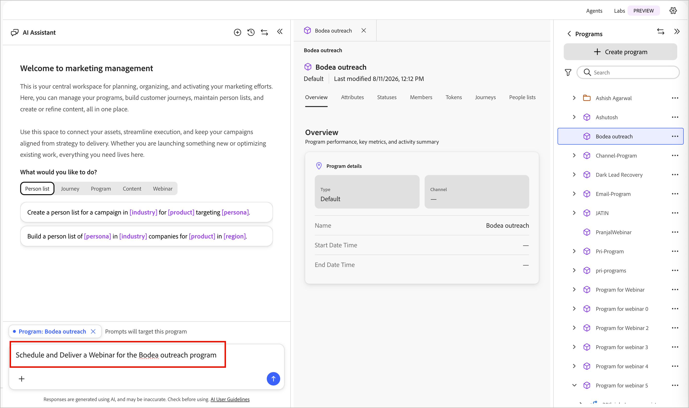
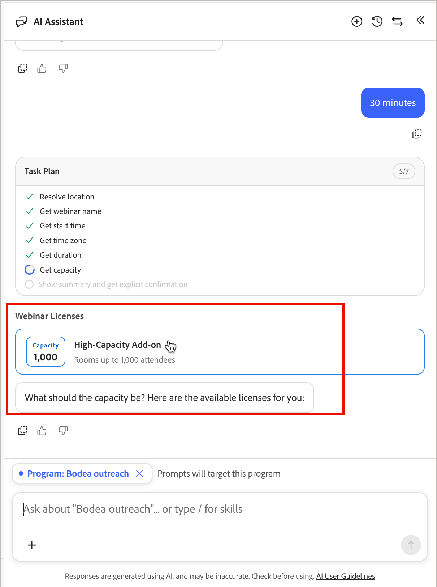

# ウェビナーの作成とプロモーション

[ チャットインターフェイス ](./chat-interface.md)は、ウェビナーの作成からプロモーション、配信、ウェビナー後のナーチャリング、レポート作成まで、すべて会話ペインを通じてウェビナーを受け取ることができます。 チャットインターフェイスが構築するすべては、[ インタラクティブウェビナーの概要](../marketing/webinars-overview.md)に記載されているウェビナーアセット、ジャーニー、トークンを使用しているため、いつでもチャットとデザインインターフェイスを切り替えることができます。

## エントリポイント

「マーケティング管理へようこそ」の挨拶から、**[!UICONTROL ウェビナー]** カテゴリのチップを選択すると、次のようなプロンプトが表示されます。

* *「ウェビナーのスケジュールと配信」*
* *「今後のウェビナーをすべて表示」*
* *&quot;ウェビナー[ ウェビナー名]&quot;*&#x200B;の詳細を入力

{width="700" zoomable="yes"}

プログラム内からチャットペインを開くと、そのプログラムに対してプロンプトが自動的にスコープされます。

## スケジュール済みウェビナーの追加 {#add-webinar}

ウェビナーのメッセージを1つ記述します。例えば、次のようになります。

*「2026年10月12日午後4時（アメリカ/ロサンゼルス）に、[ プログラム ]の「Cybersecurity 101：現代の脅威からデータを保護」というインタラクティブなウェビナーを作成します。」*

1. チャットペインには、**タスクプラン**&#x200B;のチェックリストが表示され、それを実行します。プログラムを解決し、名前、開始時間、終了時間、タイムゾーン、およびキャパシティを設定してから確認します。

   {width="500" zoomable="yes"}

1. チャットペインには、利用可能なウェビナー&#x200B;**ライセンス** （例えば、処理能力の値を持つ大容量アドオン）が一覧表示され、どのウェビナーを使用するかを尋ねられます。 必要なキャパシティで返信します。例：*「1000でウェビナーのキャパシティを使用する」*

   {width="500" zoomable="yes"}

1. チャットペインには、プログラム、名前、開始時間、タイムゾーン、期間、キャパシティが反映され、ウェビナーを作成する前に&#x200B;**確認**&#x200B;するように求められます。

1. ウェビナーを作成すると、チャットインターフェイスに&#x200B;**ウェビナーカード**&#x200B;が表示され、開始時間と終了時間、期間、ホスト、キャパシティ、プロバイダー（Adobe Connect）、設定URL、ローンチ URL、エンゲージメントダッシュボードのリンク、作成メタデータが表示されます。

1. チャットインターフェイスには、**次善のアクション**&#x200B;が表示されます。_ウェビナーをデザイン_、_共同ホストを追加_、_プレゼンターを追加_、_プロモーションジャーニーを設定_、_ウェビナー後のナーチャリングジャーニーを設定_&#x200B;します。

   {width="500" zoomable="yes"}

### 共同ホストとプレゼンターの追加 {#co-hosts-presenters}

**[!UICONTROL 共同ホストを追加]**&#x200B;または&#x200B;**[!UICONTROL 次の最適なアクションからプレゼンター]**&#x200B;を追加するか、直接お問い合わせください。例：*「共同ホストを追加[名] [姓] [ メール ]」*。 チャットインターフェイスでは、デザイナーで使用されているのと同じ追加ダイアログが開きます。全員が名簿ピッカーから選択するのではなく、同じ方法で追加されているので、名前と電子メールを入力します。 人物が追加されると、確認が表示されます。

{width="500" zoomable="yes"}

### ウェビナーのデザイン

**[!UICONTROL ウェビナーのデザイン]**&#x200B;を選択して、ウェビナーの設定ページを開きます。このページでは、埋め込み[!DNL Adobe Connect] デザインサーフェスでコンテンツ、レイアウト、登録設定を設定します。 そのインターフェイスでデザインの変更を完了します。チャットインターフェイスは、チャットで部屋をデザインするのではなく、そこにリンクされます。 [ ウェビナーのデザイン ](../marketing/create-webinar.md#create-and-design-a-webinar)を参照してください。

{width="500" zoomable="yes"}

## プロモーションジャーニーの構築

1. チャットインターフェイスにプロモーションジャーニーの設定を依頼する。

   テンプレートを選択し、ジャーニーに名前を付けるように求められます。例：*「招待/登録ジャーニー」*

1. チャットインターフェイスがジャーニーを作成し、メールをノードにリンクすることで、ウェビナーメンバーのステータスが更新され、招待とリマインダーのフローが構築されます。

1. チャットインターフェイスには、ジャーニーキャンバスで設定するために残されたものが一覧表示されます。

1. 「**[!UICONTROL ジャーニーノードを編集]**」をクリックし、ジャーニーを完了するために必要な情報に関する問い合わせに応答します。

   キャンペーンドキュメントをアップロードして詳細を入力したり、チャットを続けて必要なものを特定したりすることができます。

   または、ジャーニーキャンバスで直接作業して、各ノードに対処することもできます。

   * 最初のジャーニーノードを選択し、ジャーニーオーディエンスを設定します。 [詳細情報](../marketing/person-audience-node.md)
   * 招待&#x200B;_メールを送信_ ノードを選択し、**[!UICONTROL メールを編集]**&#x200B;をクリックします。 [詳細情報](../marketing/email-channel.md)
   * イベント ノードのリッスンを選択し、**[!UICONTROL イベントを編集]**&#x200B;をクリックします。 _フォームに入力_ イベントの登録フォームのイベントフィルターを設定します。 [詳細情報](../marketing/listen-for-event-nodes.md#event-filters)
   * 各ステータス変更ノードの「**[!UICONTROL ウェビナーメンバーのステータスを変更]**」フィールドを確認します。 [詳細情報](../marketing/action-nodes.md#actions-and-constraints)

1. 他のノードとアドレスの設定を完了します

1. 完了したら、**[!UICONTROL 今すぐ公開]**&#x200B;をクリックしてジャーニーを公開し、プロモーションを開始します。

## ウェビナー後のジャーニーの構築

1. ウェビナー後のジャーニーについては、チャットインターフェイスで確認してください。

   テンプレートと名前の入力を求められます。

1. チャットインターフェイスは、パスとアクションが定義された&#x200B;**分割パス** ノードを作成します。

   * **_Attended_** ブランチ （返信およびリソース _メールを送信_ ノードなど）
   * **_No-Show_** ブランチ （例：「見逃した？」） 「_メールを送信_ ノード）を再視聴する

   各ノードの後には、_Wait_&#x200B;およびフォローアップ _Send email_ ノードが続きます。

   _参加済みウェビナー_&#x200B;を使用して、ウェビナーの状態を識別するように分割条件が設定されています。

1. 「**[!UICONTROL ジャーニーノードを編集]**」をクリックし、ジャーニーを完了するために必要な情報に関する問い合わせに応答します。

   キャンペーンドキュメントをアップロードして詳細を入力したり、チャットを続けて必要なものを特定したりすることができます。

   または、ジャーニーキャンバスで直接作業して、各ノードに対処することもできます。

1. 他のノードとアドレスの設定を完了します

1. 完了したら、**[!UICONTROL 今すぐ公開]**&#x200B;をクリックしてジャーニーを公開し、フォローアップを開始します。

## レポートを確認

チャットインターフェイスで、*「今後のウェビナーをすべて表示する」*&#x200B;または&#x200B;*「ウェビナー[name]&quot;*&#x200B;の詳細を指定する」などのレポートに関する質問を行うことができます。 エンゲージメントダッシュボードリンクと、ウェビナーの日付&#x200B;**に** デザイン **、**&#x200B;共同ホストの追加&#x200B;**、**&#x200B;公開などの次善のアクションが表示されます。

より詳細な分析（出席、投票とアンケートのパフォーマンス、メンバーごとのデータ）を行うには、チャットインターフェイスからウェビナーの&#x200B;**Analytics** タブと&#x200B;**メンバー** タブ、および&#x200B;**ウェビナー管理**&#x200B;のプログラム間のロールアップにリンクします。<!-- See [Webinar reporting](https://experienceleague.adobe.com/en/docs/journey-optimizer-b2b/prime/marketing-management/webinars/webinar-reporting). -->
