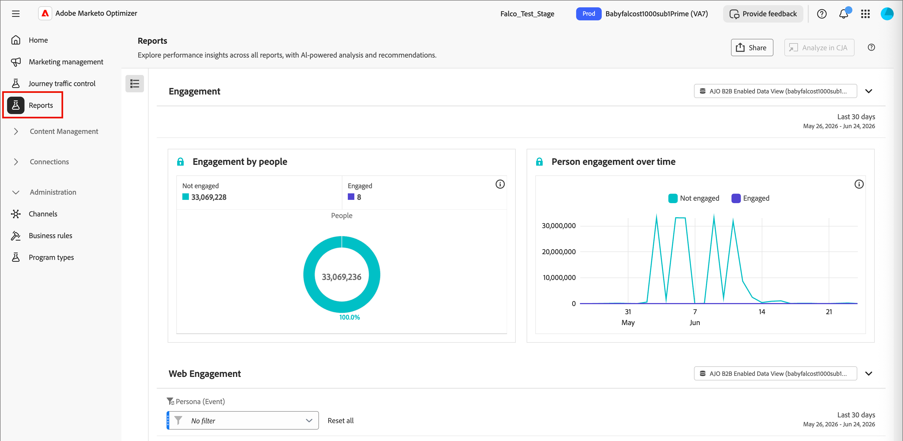

# ユーザーエンゲージメントスコア {#engagement-scores}

>[!CONTEXTUALHELP]
>id="ajo-b2b-prime_person_engagement_score"
>title="ユーザーエンゲージメントスコア"
>abstract="ユーザーエンゲージメントスコアは、最近のアクティビティに基づいて、個々のリードのエンゲージメントのレベルを反映します。"

個人エンゲージメントスコアとは、個々のリードのエンゲージメントレベルを反映した数値です。 スコアは、個人が実行するアクティビティに基づいています。各アクティビティタイプには、重み付けされた値が格納されています。 スコアは、インスタンス（テナント）内で正規化されるので、一貫性のある比較が可能になり、実用的なインサイトを可能にします。

スコア計算は毎日実行されます。 過去30日以内にエンゲージメントに重み付けされたアクティビティが、スコアに影響を与えます。 この30日間のローリングウィンドウでは、古いアクティビティの発生回数は期限切れになり、スコアは時間の経過とともに減少する可能性があります（スコア減衰）。 表示されるスコアは丸められます（例えば、スコア 75.89999は76と表示されます）。

エンゲージメントスコアデータは、**[!UICONTROL レポート]**&#x200B;から入手できます。

{width="800" zoomable="yes"}

人物エンゲージメントスコアは、人物ジャーニーの人物リストおよび分割パスノードで[&#x200B; フィルター条件](#engagement-score-filter)として使用できる属性です。

## エンゲージメントスコアリングに使用されるアクティビティ {#activities}

エンゲージメントスコアリングは&#x200B;_トリガーベース_&#x200B;ではありません。 あらゆるリードのアクティビティを評価し、スコアを再計算する日々のプロセスです。 アクティビティでは、_重み_&#x200B;を使用して、アクティブな重み付けモデルに従ってスコアリングを通知します。これにより、各アクティビティタイプが全体的なスコアにどの程度貢献しているかを判断できます。

アクティビティタイプごとに1日の頻度キャップは20です。 1日に同じアクティビティを20回以上実行した場合、そのアクティビティのカウントは20に制限されます。

| アクティビティ名 | 方向 | 説明 | デフォルトの重み付け |
|---|---|---|---|
| 会議に参加 | インバウンド | 対面でのエンゲージメントシグナル | 60 |
| メールをクリック | インバウンド | アクティブクリック =有意義なエンゲージメント | 30 |
| セールスメールクリック | インバウンド | 営業活動のアクティブクリック | 30 |
| 「Marketo電子メール」をクリックします | インバウンド | アクティブクリック =有意義なエンゲージメント | 30 |
| Conciergeについて | インバウンド | コンシェルジュツールによるライブエンゲージメント | 60 |
| Conciergeのライブチャットに参加 | インバウンド | ライブチャット =購買意欲が高い | 60 |
| Marketo フォームへの入力 | インバウンド | フォーム入力=明示的なリードインテント | 40 |
| 注目のアクション | インバウンド | 高価値な行動トリガー | 60 |
| 新規リード | インバウンド | エントリポイント – ベースラインスコア | 30 |
| メールを開く | インバウンド | パッシブエンゲージメント（クリックよりも低） | 30 |
| Marketoの電子メールを開く | インバウンド | パッシブエンゲージメント（クリックよりも低） | 30 |
| セールスメールを開く | インバウンド | パッシブエンゲージメント（クリックよりも低） | 30 |
| WhatsApp メッセージを読む | インバウンド | パッシブ読み取り；低重量チャネル | 30 |
| 転送メール（友達宛て）を受信 | インバウンド | バイラルシグナル、軽度の陽性 | 30 |
| 営業用メールに返信 | インバウンド | 直接返信=強力な購買シグナル | 40 |
| キャンペーンのリクエスト | インバウンド | 自己主導のアクション – 高いインテント | 30 |
| Marketo Campaignをリクエスト | インバウンド | 自己主導のアクション – 高いインテント | 30 |
| Conciergeでのミーティングのスケジュール | インバウンド | 最も高いインテントのコンバージョンアクション | 60 |

>[!NOTE]
>
>エンゲージメントスコアアクティビティは、個人のMarketo Engage アクティビティログに記録されます。 このログには、関連付けられているMarketo Engage インスタンスからアクセスできます。 詳しくは、Marketo Engage ドキュメントの「[&#x200B; ユーザーのアクティビティログを探す](https://experienceleague.adobe.com/ja/docs/marketo/using/product-docs/core-marketo-concepts/smart-lists-and-static-lists/managing-people-in-smart-lists/locate-the-activity-log-for-a-person){target="_blank"}」を参照してください。

## スコアリングロジック {#scoring-logic}

マルチステップの正規化プロセスを適用して、インスタンス内のあらゆるリードで一貫性のあるスコアを生成します。

1. 電子メールのクリック、フォーム入力、イベントへの参加など、関連する重み付けおよび日次ノルマを持つ&#x200B;_エンゲージメント重み付けされたすべての_ アクティビティタイプを特定します。

1. 現在30日間の振り返りウィンドウ内で、ユーザーが実行したすべての&#x200B;_エンゲージメント重み付け_ アクションを特定します。

1. 手順1で特定されたすべての&#x200B;_エンゲージメント重み付け_ アクティビティタイプのアクティビティタイプの重みを正規化し、ルックバックウィンドウ内で発生しなかったタイプを無視します。

   この手順では、_Min-Max Normalization_&#x200B;を使用し、ほとんどのアクティビティタイプを使用しないインスタンスのアクティビティタイプの重みの人工希薄化を減らします。

1. 1人当たりの1日の頻度キャップとアクティビティタイプを適用します。

   このステップは、大量で価値の低いアクティビティが全体的なスコアに与える影響を軽減します。

1. アクティビティタイプごとの日々のアクティビティを合計し、関連する重みを掛け、ルックバックウィンドウですべての日の結果を合計することで、生のエンゲージメントスコアを計算します。

1. 外れ値の影響を減らして分散を安定させるには、_電力変換_ （平方根）を適用します。

   この変換により、歪みが軽減され、データのパターンがより直線的になります。

1. スコアが0から100までの範囲を完全に使用するように、_スケール正規化_&#x200B;変換を適用します。

## エンゲージメントスコアでフィルタリング {#engagement-score-filter}

人物エンゲージメントスコアは、人物リストのオーディエンスを定義する際や、人物ジャーニーのセグメンテーションに使用する際のフィルターとして使用できます。

_[!UICONTROL 人物エンゲージメントスコア]_ フィルターは、**[!UICONTROL 人物の属性]** カテゴリの下のフィルターパネルに表示されます。

### ユーザーリスト {#people-lists}

[静的な人物リスト &#x200B;](./people-lists.md#static-lists)のメンバーを管理する場合、または[動的な人物リスト &#x200B;](./people-lists.md#dynamic-lists)のルールを定義する場合、人物エンゲージメントスコアでフィルタリングして、条件に一致する人物をターゲットにすることができます。

{width="700" zoomable="yes"}

**静的リスト – メンバーを追加**

1. 静的リストを開き、右上の「**[!UICONTROL 人物を追加]**」をクリックします。

1. フィルターダイアログで、**[!UICONTROL 人物の属性]**&#x200B;を展開し、**[!UICONTROL 人物のエンゲージメントスコア]**&#x200B;をキャンバスにドラッグします。

1. フィルター条件で、演算子を選択し、ターゲットにするスコアに一致する値を入力します。

1. 「**[!UICONTROL 完了]**」をクリックしてフィルターを適用し、一致するユーザーをリストに選定します。

**動的リスト – メンバーシップルールの設定**

1. 動的リストを開き、「**[!UICONTROL ルール]**」タブを選択します。

1. 「**[!UICONTROL ルールを編集]**」をクリックします。

1. フィルターダイアログで、**[!UICONTROL 人物の属性]**&#x200B;を展開し、**[!UICONTROL 人物のエンゲージメントスコア]**&#x200B;をキャンバスにドラッグします。

1. フィルター条件で、演算子を選択し、ターゲットにするスコアに一致する値を入力します。

1. 「**[!UICONTROL 完了]**」をクリックして、ルールを保存します。

   メンバーシップは、個人レコードがルールに対して評価されると自動的に更新されます。

### 顧客ジャーニー {#person-journeys}

[_分割パス_ ノード &#x200B;](../marketing/split-merge-paths-nodes.md)で個人ジャーニーのセグメント化を設定する場合、個人プロファイルフィルターとして個人エンゲージメントスコアを使用して、ジャーニーパスに入るユーザーを制御できます。

{width="700" zoomable="yes"}

1. ジャーニーキャンバスの「**[!UICONTROL パスを分割]**」ノードをクリックします。

1. 右側のノードプロパティパネルで、パスの「**[!UICONTROL 条件を適用]**」または「**[!UICONTROL 条件を編集]**」をクリックします。

1. フィルターダイアログで、**[!UICONTROL 人物の属性]**&#x200B;を展開し、**[!UICONTROL 人物のエンゲージメントスコア]**&#x200B;をキャンバスにドラッグします。

1. フィルター条件で、演算子を選択し、ターゲットにするスコアに一致する値を入力します。

1. 「**[!UICONTROL 完了]**」をクリックして、パスのフィルターを保存します。

## エンゲージメントスコアの重み付けを設定 {#configure-weighting}

[!DNL Marketo Optimizer]では、[同僚チャットインターフェイス &#x200B;](../agents/chat-interface.md)から直接エンゲージメントスコアの重み付けを設定できます。

エンゲージメントスコアモデル、重み付けバンド、アクティビティの重みづけの背景については、[&#x200B; カスタムエンゲージメントスコアの重み付けの設定](https://experienceleague.adobe.com/en/docs/journey-optimizer-b2b/user/admin/configurations/engagement-score-weighting)を参照してください。

1. 画面（チャットアイコン）の左側から&#x200B;**[!UICONTROL 同僚]** チャットパネルを開きます。

1. チャット入力フィールドに、スラッシュコマンドを入力し、その後にインテントを入力します。 例：

   `/engagement-configuration Configure activity weights for the person engagement score model`

   `/`を入力すると、Coworkerは使用可能なスラッシュコマンドとスキルのリストを表示します。 エンゲージメント設定コマンドは、エンゲージメントスコアの重み付けページに直接ルーティングします。

   {width="700" zoomable="yes"}

1. _送信_ （上向き矢印）アイコンをクリックするか、Enter キーを押します。

   同僚はリクエストを処理し、チャットパネルの横にあるメインコンテンツ領域に「**[!UICONTROL エンゲージメント設定]**」タブを開きます。

### エンゲージメントスコアの重み付けリストの確認 {#review-weighting-list}

タブが開くと、_エンゲージメントスコアの重み付け_ ページには、既存のすべてのスコアリングモデルが次の列を含むテーブルに表示されます。

| 列 | 説明 |
|---|---|
| **名前** | モデル名（クリックして詳細を開く） |
| **ステータス** | アクティブ、ドラフト、またはアーカイブ済み |
| **作成日** | モデルが作成されたとき |
| **最終更新日** | 最新の保存タイムスタンプ |
| **最終更新者** | 最後に変更を保存したユーザー |

{width="700" zoomable="yes"}

任意の時点で、アクティブにできるのは&#x200B;**one** モデルのみです。 現在アクティブなモデルは、すべてのエンゲージメントスコア計算に適用されます。

### スコアリングモデルを開く {#open-scoring-model}

リスト内の任意のモデルの名前をクリックして、その詳細ページを開きます。

詳細ページには次の内容が表示されます。

* モデル名と現在のステータス バッジ （_アクティブ_、_ドラフト_、または&#x200B;_アーカイブ_）
* アクティビティリストをフィルタリングする&#x200B;_検索_ フィールド
* **[!UICONTROL エンゲージメントアクティビティ]**、**[!UICONTROL 重み付け]**、**[!UICONTROL 最終更新日]**、**[!UICONTROL 最終更新日]**&#x200B;列を含む完全なアクティビティテーブル

{width="700" zoomable="yes"}

アーカイブされたモデルの場合、**[!UICONTROL 削除]**&#x200B;と&#x200B;**[!UICONTROL 重複]**&#x200B;が右上に表示されます。 ドラフトモデルの場合は、**[!UICONTROL Activate]**&#x200B;も表示されます。

### ドラフトモデルのアクティビティウェイトの編集 {#edit-activity-weights}

ドラフトモデルには、エンゲージメントアクティビティごとに編集可能な&#x200B;_[!UICONTROL 重み付け]_ オプションがあります。 重みを変更するには：

1. リストでドラフトモデル名をクリックします。

1. アクティビティテーブルで、更新するエンゲージメントアクティビティを見つけます。

1. アクティビティの&#x200B;**[!UICONTROL 重み付け]**&#x200B;下向き矢印をクリックし、適切な重み付けバンドを選択します（例：`Important`、`Trivial`、`Minor`、`Normal`、および`Vital`）。

   変更は自動的に保存されます。明示的な「保存」アクションは必要ありません。

>[!NOTE]
>
>アクティブなモデルまたはアーカイブされたモデルを編集するには、そのモデルを複製して新しいドラフトモデルを作成し、複製したモデルを編集してアクティブにします。 アクティブなモデルをインプレースで編集することはできません。

### ドラフトモデルのアクティベート {#activate-weighting-model}

ドラフトモデルをアクティベートすると、以前にアクティブだったモデルが自動的にアーカイブされます。 新しくアクティブ化されたモデルは、今後のすべてのエンゲージメントスコア計算に適用されます。 ドラフトモデルが正しいアクティビティの重みで設定されている場合：

1. リストでドラフトモデル名をクリックします。

1. 右上の「**[!UICONTROL アクティブ化]**」をクリックします。

1. ダイアログで確認します。

