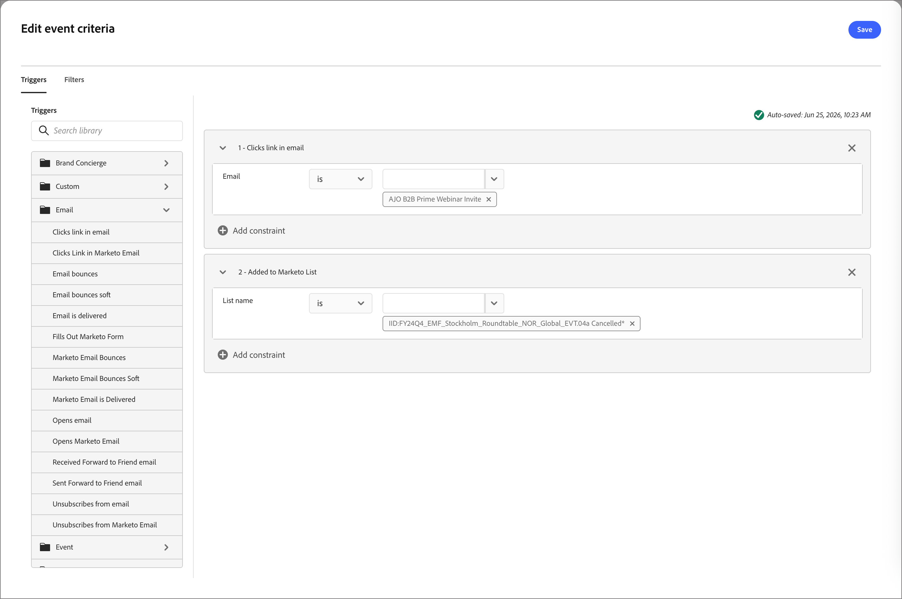

# イベントベースのオーディエンス

[!DNL Adobe Marketo Optimizer]では、_イベントベースのオーディエンス_&#x200B;が、[!DNL Marketo Engage]のアクティビティが発生したときに、ほぼリアルタイムでライブ [人のジャーニー](../marketing/person-journeys.md)にオーディエンスメンバーを追加できます。 イベントベースのオーディエンスは、ジャーニーキャンバスのオーディエンスノードで設定します。

* 対象となるイベントとして、1つ以上の[!DNL Marketo Engage] アクティビティ（標準またはカスタム）を選択します。
* オプションで、個人プロファイルフィルター（業界、地域、ライフサイクルステージなど）を追加して、入力できる個人を絞り込みます。
* オプションで、アクティビティ属性の制約（特定のフォーム、URL、プログラムなど）を定義して、各アクティビティの出現箇所を絞り込みます。

適格なアクティビティがリードの[!DNL Marketo Engage]にログインして[!DNL Adobe Marketo Optimizer]にレプリケートされると、システムは、対応する人物レコードを設定されたフィルターと制約に照らして評価します。 条件が満たされると、オーディエンスは直ちにオーディエンスノードを通じてジャーニーに入ります。

_個人ジャーニーのイベントベースのオーディエンスを定義するには&#x200B;:_

1. [_人物オーディエンス_ ノード ](../marketing/person-audience-node.md)を選択します。

1. 右側のノードプロパティで、エントリタイプとして「**[!UICONTROL イベントオーディエンス]**」を選択します。

   {width="400"}

1. 「**[!UICONTROL イベント条件を追加]**」をクリックします。

1. _[!UICONTROL イベント条件を編集]_ ダイアログで、次のように、1つ以上の[!DNL Marketo Engage] アクティビティを対象イベントとして追加します。

   * _ウェビナーに参加_
   * _電子メールが配信されました_
   * _電子メール内のリンクをクリック_

   >[!NOTE]
   >
   >関連する[!DNL Marketo Engage] インスタンスで定義されたカスタムアクティビティを選択することもできます。

   各アクティビティの一致する演算子と値を設定します。

   {width="700" zoomable="yes"}

   設定されたアクティビティのいずれかがリード用にログに記録されると、ジャーニーの対象となります。

1. （オプション）イベントとフィルターの組み合わせをオーディエンスの選定に使用するには、個人レベルのフィルターを追加します。

   * 「**[!UICONTROL フィルター]**」タブを選択します。
   * 各フィルターをドラッグして、一致する条件を設定します。

   {width="700" zoomable="yes"}

   フィルターを追加する場合、ユーザーは少なくとも1つの設定されたアクティビティ条件と設定されたフィルターを満たす必要があります。

1. 「**[!UICONTROL 保存]**」をクリックします。