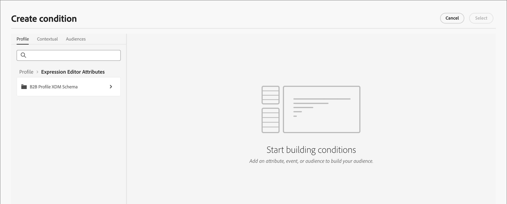

# 条件付きコンテンツ

条件付きコンテンツを使用すると、条件付きルールに基づいてメールコンテンツやフラグメントコンテンツを適応させることができます。 これらのルールは、プロファイル属性またはコンテキストイベントを使用して定義されます。 ルールビルダーで条件付きルールを作成し、複数のユーザージャーニーにわたって再利用できるように保存できます。

条件付きコンテンツをフラグメントとメールメッセージに追加するには、[!DNL Marketo Optimizer]を使用すると、_条件_ ライブラリに保存されている条件付きルールを適用できます。 [電子メールコンテンツ &#x200B;](./email-authoring.md)または[&#x200B; フラグメント &#x200B;](./fragment-authoring.md)を作成する際に、ビジュアルデザインスペース内で条件付きルールを適用します。

## 条件付きコンテンツを追加 {#add-conditional-content}

>[!CONTEXTUALHELP]
>id="ajo-b2b-prime_conditional_content"
>title="条件付きコンテンツ"
>abstract="条件付きルールを使用すると、コンテンツコンポーネントのバリアントを複数作成できます。 メッセージの送信時にどの条件も満たされない場合は、デフォルトバリアントのコンテンツが表示されます。"

>[!CONTEXTUALHELP]
>id="ajo-b2b-prime_conditional_rule_select"
>title="条件付きコンテンツ"
>abstract="ライブラリに保存されている条件付きルールを使用するか、新しい条件付きルールを作成します。"

ビジュアルデザイン空間で[&#x200B; フラグメント &#x200B;](./fragment-authoring.md)または[電子メール &#x200B;](./email-authoring.md)を作成する場合、条件付きルールを使用して、コンテンツコンポーネントに複数のバリエーションを定義します。

1. コンテンツコンポーネントを選択し、コンポーネントツールバーの「**[!UICONTROL コンディショナルコンテンツを有効にする]**」アイコンをクリックします。

   [&#x200B; コンテンツコンポーネントツールバー](./content-components.md#content-component-toolbars)を参照してください。

   コンポーネントは、コンディショナルコンポーネントとしてアクティブ化されていることを示すために、オレンジ色で概略が示されます。 **[!UICONTROL 条件付きコンテンツ]** ペインが左側に表示され、_デフォルトバリアント_&#x200B;と&#x200B;_バリアント - 1_&#x200B;が表示されます。

   {width="700" zoomable="yes"}

   選択してアクティブ化した元のコンテンツはデフォルトであり、定義したバリエーションに対して条件ルールが満たされていない場合に適用されます。

   このペインでは、条件付きルールを使用して、選択したコンテンツコンポーネントに複数のバリエーションを定義できます。

1. 最初のバリアント （_バリアント - 1_）にカーソルを合わせ、_条件を選択_ アイコン （）をクリックします。

   {width="700" zoomable="yes"}

   _[!UICONTROL 条件を選択]_ ダイアログが開き、条件ライブラリが表示されます。

   条件の詳細を表示して目的の条件を確認する場合は、_詳細メニュー_ アイコン （**...**）をクリックします **[!UICONTROL 情報を表示]**&#x200B;を選択します。

   {width="600" zoomable="yes"}

   必要な条件が存在しない場合は、**[!UICONTROL 新規作成]**&#x200B;をクリックして[条件付きルール &#x200B;](#create-conditional-rule)を作成します。

1. 条件付きルールを選択し、**[!UICONTROL 選択]**&#x200B;をクリックしてバリアントに関連付けます。

<!-- 

   You can review the associated condition by clicking the _More menu_ icon (**...**) for the variant and choosing **[!UICONTROL View condition]**.

   {width="600" zoomable="yes"}

   Click X at the top right to close the popup.

   {width="500"}

   -->

1. 読みやすくするために、_詳細メニュー_ アイコン （**...**）をクリックして、バリエーションの名前を変更します バリエーションを選択し、**[!UICONTROL 名前を変更]**&#x200B;します。

   バリエーションとその意図を識別するのに役立つ、バリエーションの意味のある名前を入力します。

   {width="600" zoomable="yes"}

1. 左側のペインでバリアントを選択した状態で、コンポーネントを変更して、条件がtrueの場合にメッセージにどのように表示されるかを変更します。

   この例では、テキストコンポーネントのバリアントで、受信者の領域に基づいて異なる説明が使用されています。

   {width="600" zoomable="yes"}

1. 必要に応じて、**[!UICONTROL バリアントを追加]**&#x200B;をクリックして別のバリアントを定義します。

   手順2～5を繰り返して、条件を選択し、バリアントの名前を変更し、バリアントのコンポーネントを変更します。

   コンテンツコンポーネントに必要な数のバリエーションを追加できます。 左側のペインで選択したバリエーションをいつでも変更して、条件に対してコンテンツコンポーネントがどのように表示されるかを確認できます。

   >[!IMPORTANT]
   >
   >条件付きコンテンツは、バリエーションがリストされる順序で、関連するルールに対して評価されます。 trueと評価される条件を持つ最初のバリアントがコンポーネントに使用されます。
   >
   >メッセージの送信時に定義されたバリアント条件のいずれもtrueと評価されない場合、コンテンツコンポーネントは&#x200B;**[!UICONTROL デフォルトのバリアント]**&#x200B;に従って表示されます。

1. バリエーションを削除するには、_詳細メニュー_ アイコン （**...**）をクリックします バリエーションを選択し、**[!UICONTROL 削除]**&#x200B;を選択します。

   確認ダイアログで「**[!UICONTROL 削除]**」をクリックします。

## 条件付きルール {#conditional-rules}

条件付きルールは、trueまたはfalseとして評価できる条件式のセットです。 これらのルールを使用して、プロファイル属性やコンテキストイベントなどのさまざまなフィルターにもとづいて、メッセージに表示するコンテンツバリエーションを決定します。

ルールは条件ライブラリに保存され、メールやフラグメントコンテンツをまたいで組織で再利用できます。

<!--
M1.5 info -- out of date?

### Condition filters {#condition-filters}

| Condition type | Filters | Description |
| -------------- | ------- | ----------- |
| **Account** | Account Attributes | Attributes from the account profile, including: <li>Annual revenue</li><li>City</li><li>Country</li><li>Employee size</li><li>Industry</li><li>Name</li><li>SIC code</li><li>State</li> |
| | [!UICONTROL Special filters] > [!UICONTROL Has Buying Group] | The account does or does not have members of buying groups. The filter can also be evaluated against one or more of the following criteria: <li>Solution Interest</li><li>Buying Group status</li><li>Completeness Score</li><li>Engagement Score</li> |
| **Person** | [!UICONTROL Activity history] > [!UICONTROL Email] | Email activities associated with the journey: <li>[!UICONTROL Clicked link in email]</li><li>Opened Email</li><li>Was delivered email</li><li>Was sent email</li> These conditions are evaluated using a selected email message from earlier in the journey. |
| | [!UICONTROL Person Attributes] | Attributes from the person profile, including: <li>City</li><li>Country</li><li>Date of birth</li><li>Email address</li><li>Email invalid</li><li>Email suspended</li><li>First name</li><li>Inferred state region</li><li>Job title</li><li>Last name</li><li>Mobile phone number</li><li>Phone number</li><li>Postal code</li><li>State</li><li>Unsubscribed</li><li>Unsubscribed reason</li> |
| | [!UICONTROL Special filters] > [!UICONTROL Member of Buying Group] | The person is or is not a buying group member evaluated against one or more of the following criteria: <li>Solution Interest</li><li>Buying Group status</li><li>Completeness Score</li><li>Engagement Score</li><li>Is Removed</li><li>Role</li> |
-->

### 条件付きルールの作成 {#create-conditional-rule}

>[!CONTEXTUALHELP]
>id="ajo-b2b-prime_conditions_rule_editor"
>title="条件の作成"
>abstract="属性とコンテキストイベントを組み合わせて、メールメッセージに表示するコンテンツバリアントを決定するルールを作成します。"

コンポーネントバリアントの条件を選択すると、デザインスペースから条件付きルールビルダーにアクセスできます。

1. _[!UICONTROL 条件を選択]_ ダイアログで、**[!UICONTROL 新規作成]**&#x200B;をクリックします。

   {width="700" zoomable="yes"}

   このアクションは、_[!UICONTROL 条件を作成]_ ダイアログを開きます。 ダイアログツールを使用して、属性をカンバスに結合します（Experience Platformでのセグメント構築エクスペリエンスと同様）。 フィルター属性は、次の3つのタブに分かれています。

   * **[!UICONTROL プロファイル]** - B2B プロファイル XDM スキーマには、Adobe Experience Platformで定義されたExperience Data Model （XDM） スキーマに関連付けられたすべてのプロファイル属性が一覧表示されます。

   * **[!UICONTROL コンテキスト]** - メッセージがジャーニーで使用されている場合、このタブを通じてコンテキストジャーニーフィールドを使用できます。

   * **[!UICONTROL Audiences]** - Adobe Experience Platform Segmentation Serviceで作成されたセグメント定義から生成されたすべてのオーディエンスを一覧表示します。

   {width="700" zoomable="yes"}

1. 必要に応じて、条件付きルールを作成します。

   ルールに含める各フィルターについて、項目をルールキャンバスにドラッグ&amp;ドロップします。 フィルターを展開し、式を完了します。

   {width="700" zoomable="yes"}

   必要に応じて、追加のフィルターをドラッグ&amp;ドロップします。

   複数のフィルターを含める場合は、フィルターの適用方法に応じてフィルターロジック設定を切り替えることができます。

   * **[!UICONTROL And]** - フィルター&#x200B;**all**&#x200B;がtrueの場合、ルールはtrueと評価されます。
   * **[!UICONTROL または]** - フィルターの&#x200B;**any**&#x200B;がtrueの場合、ルールはtrueと評価されます。

   {width="700" zoomable="yes"}

1. 条件にカスタムルールを使用するには、**[!UICONTROL 選択]**&#x200B;をクリックします。

   ルールを再利用できるようにするには、ルールをライブラリに追加します。

### ライブラリへの条件の追加 {#add-to-library}

1. 条件を作成ダイアログで、下部の「**[!UICONTROL 条件を保存]**」をクリックします。

1. 右側に、ルールの&#x200B;**[!UICONTROL Name]** （必須）と&#x200B;**[!UICONTROL Description]** （オプション）を入力します。

   意味のある名前と便利な説明を使用して、組織内の他のユーザーが重複する条件を作成せずに再利用できるようにします。

   {width="700" zoomable="yes"}

1. 「**[!UICONTROL 追加]**」をクリックします。

   コンディショナルルールがライブラリに保存され、現在のバリアントに対して選択できます。 ライブラリにも含まれており、他の動的コンテンツのバリエーションでも使用できます。

>[!NOTE]
>
>ライブラリに保存されている条件付きルールは変更できません。 ただし、保存したルールを使用して、新しいルールを作成できます。 これを行うには、条件付きルールを開き、目的の変更を行い、新しい名前でライブラリに保存します。

<!--

### Duplicate a rule {#duplicate-rule}

Conditional rules saved to the library cannot be modified. However, you can duplicate an existing rule and change it to create a new rule.

1. Click the _More menu_ icon (**...**) for the variant and choose **[!UICONTROL Duplicate]**.

   A duplicate of the rule opens in the rule builder. Use the duplicate as a starting point for the rule that you want to build.

   {width="600" zoomable="yes"}

1. In the rule builder, change, add, or delete conditions according to what you need.

1. Change the name and description to match the purpose or items in the rule.

1. When your conditional rule is complete, click **[!UICONTROL Save]**.
-->
