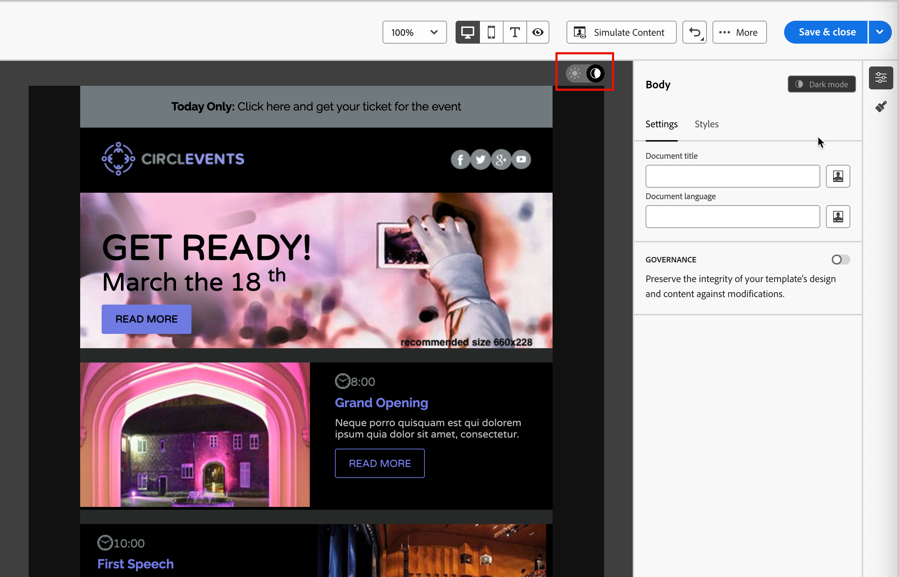
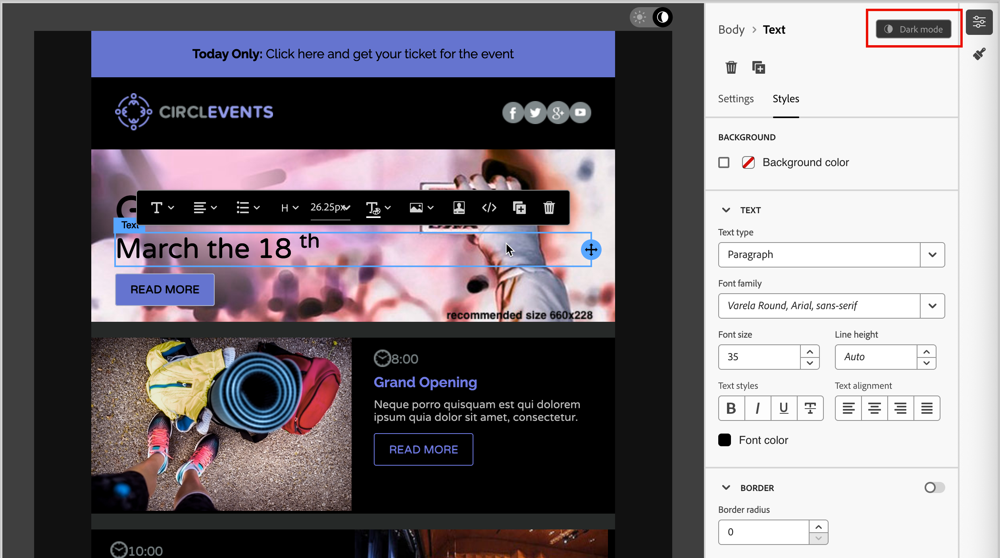

# メールコンテンツのダークモード {#dark-mode}

>[!CONTEXTUALHELP]
>id="ajo-b2b_dark_mode"
>title="ダークモードに切り替え"
>abstract="ダークモードに切り替えると、レンダリングのプレビューやカスタム設定の定義ができます。  レンダリングは、受信者のメールクライアントに応じて異なります。 すべてのメールクライアントがカスタムダークモードをサポートしているわけではありません。"

>[!CONTEXTUALHELP]
>id="ajo-b2b_dark_mode_preview"
>title="ダークモードに切り替え"
>abstract="ダークモードに切り替えると、サポートされているメールクライアントでレンダリングをプレビューできます。  最終的なレンダリングは、受信者のメールクライアントに応じて異なります。 すべてのメールクライアントがダークモードをサポートしているわけではありません。"

_ダークモード_&#x200B;を使用すると、サポートメールクライアントまたはアプリで、テキスト、ボタン、その他のビジュアル要素の背景が暗く、色が明るいメールを表示できます。 このタイプのディスプレイは、目の疲れを軽減し、バッテリー寿命を節約し、低光量環境での読みやすさを向上させ、より快適な視聴体験を実現します。 主要なオペレーティングシステムやアプリでトレンドが高まる中、あらゆるユーザーに読みやすく視覚的に魅力的なコンテンツを提供することが、今日のメール設計における重要な検討事項となっています。

[!DNL Marketo Optimizer] ビジュアルデザイン空間で[電子メールコンテンツ ](./email-authoring.md)を作成すると、_**[!UICONTROL ダークモード]**_&#x200B;表示に切り替えることができます。 このビューでは、ダークモードが有効になっているメールクライアントをサポートするための特定のカスタム設定を定義することもできます。

## メールクライアントの考慮事項 {#email-client-considerations}

メールクライアントやアプリによって、ダークモードの適用方法には大きな違いがあります。 このため、ダークモードのレンダリングに対する期待は慎重に考慮してください。 メールデザイン分野でダークモードを使用する前に、次のメールクライアントのユースケースを検討してください。

+++ダークモードをサポートしていないクライアント

次のように、この機能をまったくサポートしていないメールクライアントもあります。

* [!DNL Yahoo! Mail]
* [!DNL AOL]

電子メールデザインでダークモードのカスタム設定を定義した場合、これらの電子メールクライアントはダークモードのレンダリングを表示できません。

+++

+++独自のダークモードを適用しているクライアント

一部のメールクライアントでは、受信したすべてのメールに対して、独自のデフォルトのダークモードを体系的に適用しています。 ダークモードの設定に応じて、色、背景、画像などの要素が自動的に調整され、外部設定はできません。 顧客は次の通りです。

* Gmail （デスクトップ web メール、iOS、Android™、モバイルウェブメール）
* Windows 版 Outlook
* Outlook Windows メール

この場合、クライアントダークモード設定は、[!DNL Marketo Optimizer]で定義したカスタムダークモード設定を上書きします。

+++

+++カスタムダークモードをサポートするクライアント

最も人気のある電子メールクライアントの多くは、`@media (prefers-color-scheme: dark)` クエリでのカスタムダークモードのレンダリングをサポートしています。これは、[!DNL Marketo Optimizer]電子メールスタイルで使用される方法です。 このクライアントのリストには、次のものが含まれます。

* Apple メール macOS
* Apple メール iOS
* Outlook macOS
* Outlook.com
* Outlook iOS
* Outlook Android™

この場合、[!DNL Marketo Optimizer]で定義した特定の設定がレンダリングされます。 ただし、各メールクライアントに応じて、いくつかの制限を適用できます。 例えば、一部のクライアント（Apple Mail 16 （macOS 13）など）では、画像がメールコンテンツに存在する場合、ダークモードが生成されません。

最適な結果を得るには、ターゲットとするメールクライアントでコンテンツをテストします。

+++

## ダークモードのデザイン

[!DNL Marketo Optimizer]のビジュアルデザインスペースには、メールコンテンツをダークモードでスタイル設定するための2種類のツールが用意されています。

* [ プレビュー関数](#preview-dark-mode)を使用して、ほとんどのサポート電子メールクライアントのデフォルトのダークモードのレンダリングを確認します。

* サポートするメールクライアントのデフォルト設定を上書きする場合は、メールコンテンツに[ カスタムダークモード設定](#custom-dark-mode)を定義して適用します。

### デフォルトのダークモードのプレビュー {#preview-dark-mode}

1. 電子メールデザイン画面で電子メールコンテンツを開きます。

   キャンバスの右上には、明るい（デフォルト）と暗いモードの間でコンテンツ表示を切り替える明るい暗いセレクターがあります。

   {width="700" zoomable="yes"}

1. セレクターを&#x200B;_ダークモード_&#x200B;に変更します（）。

   キャンバスには、デフォルトのダークモードのプレビューを使用してコンテンツが表示されます。

   デフォルトでは、ダークモードのプレビューでは、画像とアイコンを除くすべての要素に`full color invert`の配色が適用されます。 この配色は、明るい要素と暗い要素を持つ領域を検出し、それらを反転させます。 明るい背景が暗くなり、暗いテキストが明るくなり、暗い背景が明るくなり、明るいテキストが暗くなります。

   {width="700" zoomable="yes"}

>[!CAUTION]
>
>最終的なレンダリングは、受信者のメールクライアントによって異なる場合があります。 各メールクライアントの最終結果にできるだけ近いシミュレーションを確認するには、メールデザインスペースの&#x200B;**[!UICONTROL コンテンツをシミュレート]**&#x200B;で利用できるLitmus メールレンダリング統合を使用します。

### カスタムダークモード設定を定義する {#custom-dark-mode}

>[!CONTEXTUALHELP]
>id="ajo-b2b_dark_mode_image"
>title="特定の画像をダークモードで使用"
>abstract="別の画像をダークモードで選択します。  特定の画像を追加しても、すべてのメールクライアントで正しくレンダリングされるとは限りません。 すべてのメールクライアントがカスタムダークモードをサポートしているわけではありません。"

ダークモードに切り替えた後、受信者のメールクライアントでダークモードが有効になっている場合にのみ表示されるコンテンツの特定のスタイル要素を編集できます（この機能をサポートしている場合）。

>[!NOTE]
>
>ダークモードの最終的なレンダリングはメールクライアントによって異なるため、結果もクライアントごとに変わる可能性があります。 詳しくは、[電子メールクライアントの考慮事項](#email-client-considerations)を参照してください。

カスタムダークモードのスタイル設定では、`@media (prefers-color-scheme: dark)` CSS クエリを使用して、メールクライアントがダークモードに設定されているかどうかを検出し、定義されたダークテーマのデザインを適用します。

_ダークモードのカスタム設定を定義するには&#x200B;:_

1. 必要に応じて、デザインキャンバスの右上にある&#x200B;_ダークモード_ （）にセレクターを移動します。

1. テキスト、背景、ボタンなど、スタイル設定カラー属性を編集できます。

色とフォントのオプションを表示する{width="700" zoomable="yes"}

1. 画像やアイコンの場合は、ダークモード専用の特定のアセットを定義します。

   画像やアイコンの色は変更できませんが、ダークモードで使用する代替アセットを定義できます。 アイコンの様々な色の組み合わせを試したり、写真画像の色と彩度を調整したりできます。

   異なる色の組み合わせを持つ{width="80%"}

   任意の画像を選択し、**[!UICONTROL 設定]** ペインの専用トグルを使用して&#x200B;**[!UICONTROL ダークモード]**&#x200B;に切り替えます。 次に、Marketo Design Studio アセットピッカーから別の画像アセットを選択します。

   画像アセットの選び方について詳しくは、[Marketo Design Studioから画像を挿入](./email-authoring.md#insert-image)を参照してください。

1. デザインの変更中の任意の時点で、**[!UICONTROL ライブビューに切り替え]**&#x200B;を選択して、様々なデバイスサイズでコンテンツがどのようにレンダリングされるかを確認します。

   このビューから、セレクターを&#x200B;_ダークモード_ （）に変更して、様々なデバイスでコンテンツのダークモードバージョンをプレビューします。

   {width="800" zoomable="yes"}

   >[!CAUTION]
   >
   >ライブビューは、様々なデバイスサイズでのレンダリング結果を比較できるように設計された汎用プレビューです。 最終的なレンダリングは、受信者のメールクライアントによって異なる場合があります。

1. ダークモードの変更が完了したら、「**[!UICONTROL コンテンツをシミュレート]**」をクリックして、プレビューツールとプルーフツールを使用してメールデザインをテストします。

1. Litmus Enterprise アカウントをお持ちの場合は、「**[!UICONTROL メールをレンダリング]**」を選択して、Litmus統合で様々なメールクライアントの最終的なダークモードのレンダリングを確認します。

   >[!CAUTION]
   >
   >シミュレーションでは、メールがダークモードでどのように表示されるかに非常に近いものの、実際のレンダリングは、メールサービスプロバイダーやデバイスレベルの設定の違いによって異なる場合があります。

## ベストプラクティス {#best-practices}

主要なメールクライアントでダークモードの採用が増加する中、[ カスタムダークモード ](#custom-dark-mode)を使用しているかどうかにかかわらず、明るい環境と暗い環境の両方でメールがどのようにレンダリングされるかを考慮することが不可欠です。

ダークモードでは、色、背景、画像が変更される可能性があり、場合によってはデザインの選択が上書きされることもあります。 視覚的な一貫性、アクセシビリティ、ブランドの整合性を確保するには、次のベストプラクティスに従います。

| 実践 |            |
| -------- | ---------- |
| 画像とロゴの最適化 | チェックリスト：<ul><li>ロゴやアイコンを、透明な背景のPNG ファイルとして保存して、暗いモードで白いボックスが表示されないようにします。 <li>白色の背景または明るい背景がハードコードされた画像は回避します。 <li>透明な背景を使用できない場合は、不自然な色の反転を防ぐために、デザイン内でベタ塗りの背景の上に画像を配置します。 |
| 背景を見る | チェックリスト：<ul><li>ライトモードとダークモードの両方で読みやすくするには、テキストと背景色の間に十分なコントラストを確保します。 <li>重要なコンテンツについては、背景色だけに頼らないようにします。 一部のクライアントでは、ダークモードで背景色を上書きするので、重要な情報が表示されたままになります。 |
| ダークモードでアクセスしやすいコンテンツをデザイン | チェックリスト：<ul><li>色覚異常のある人物でも簡単に区別できる色の組み合わせを使用します。 <li>明るい背景と暗い背景の両方に対してコントラストを確保するのに、ミッドトーンパレットを使用します。 <li>高コントラストでアクセスしやすい色の組み合わせを使用して、読みやすさを向上させ、[!DNL Web Content Accessibility Guidelines (WCAG)]標準を満たします。 [!DNL WebAIM Contrast Checker]などのツールを使用して、色のコントラストを検証します。 <li>読みやすさに影響を与える可能性があるため、シンなフォントは避けます。 ブランドに細いフォントが必要な場合は、ダークモードで太字にします。 <li>純粋な黒の上で純粋な白をスキップすると、目の緊張を引き起こす可能性があり、一部のメールクライアントでは自動的に反転する可能性があります。 <li>ダークモードがサポートされていない場合に備えて、アクセシビリティに配慮したフォールバック用のスタイルを用意します。 |
| ダークモード環境でのメールのテスト | チェックリスト：<ul><li>電子メールデザイン領域で[ ダークモードのプレビュー](#preview-dark-mode)を使用します。このカラースキームは、反転したカラースキームを使用して問題を早期に検出します。 <li>Litmus Enterprise アカウントをお持ちの場合は、**[!UICONTROL メールをレンダリング]** オプションを使用して、主要なメールクライアント（Apple Mail、Gmail、Outlookなど）でデザインをシミュレートし、ダークモードでカラーと画像がどのように動作するかを確認します。 |

