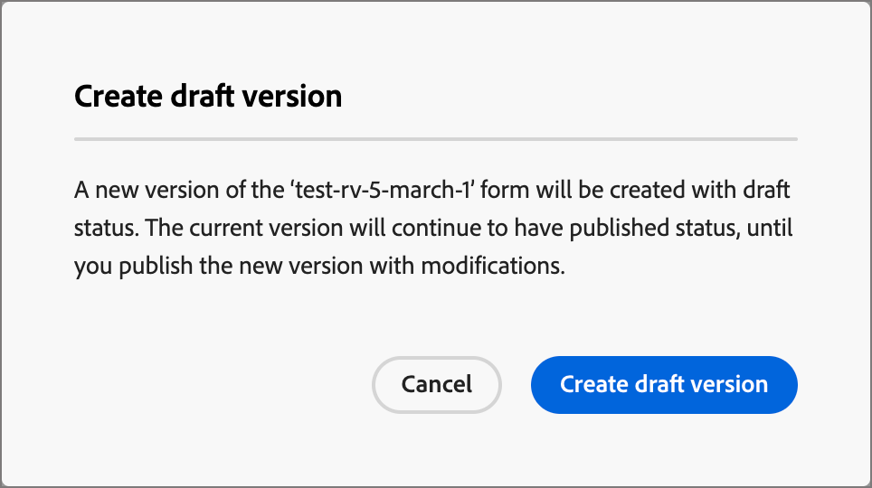

# フォーム

web ページの訪問者から情報を取得するには、フォームを作成してランディングページに追加します。 フォームとは、訪問者が入力して送信する一連のフィールドのことで、ホワイトペーパー、オンデマンドウェビナー、無料トライアルなど、何らかのコンテンツやオファーを取得するためのものです。

フォームが取得する情報の量は、コンテンツまたはオファーの価値によって異なります。 ホワイトペーパーのようなシンプルな文書を使用する場合は、名前、メールアドレス、企業名などの最小限の情報のみを収集します。 デモや無料試用版など、オファーがより価値の高いものである場合は、より多くの情報を収集できます。 コンテンツの表示を許可するために送信されたフォームを必要とすることは、_ゲーテッドコンテンツ_&#x200B;と呼ばれます。 どのコンテンツをゲートするか、どのコンテンツをゲートしないかを決定します（_無料_）。 ベストプラクティスは、一部のコンテンツを無料で許可し、プレミアムコンテンツまたは需要の高いコンテンツのみをゲートすることです。

>[!PREREQUISITES]
>
>マーケティング部門がフォームを作成して使用し、情報を取得する前に、管理者が1つ以上のフォームプリセットを定義する必要があります。 詳しくは、[_Forms設定_](../admin/configuration-presets-forms.md)&#x200B;を参照してください。

<!-- 
>Form creation in [!DNL Marketo Optimizer] requires the following [permissions](../start/user-management.md#b2b-product-permissions):
>
>* _[!UICONTROL Journey Optimizer Library]_ > _[!UICONTROL Read B2C Forms]_ - Required to access and view forms.
>* _[!UICONTROL Journey Optimizer Library]_ > _[!UICONTROL Manage B2C Forms]_ - Required to create, update, and delete forms.
>* _[!UICONTROL Journey Optimizer Library]_ > _[!UICONTROL Publish B2C Forms]_ - Required to publish forms.
-->

## フォームへのアクセスと管理 {#view-forms}

[!DNL Marketo Optimizer]のフォームにアクセスするには、左側のナビゲーションに移動し、**[!UICONTROL Content Management]**/**[!UICONTROL Forms]**&#x200B;をクリックします。 このアクションは、インスタンスで作成されたすべてのフォームを表示するリストページを開きます。

{width="800" zoomable="yes"}

システムはテーブルを&#x200B;_[!UICONTROL 変更済み]_&#x200B;列で並べ替え、デフォルトで最も最近更新されたフォームを上部に表示します。 列のタイトルをクリックして、昇順と降順を変更します。

### フォームのステータスとライフサイクル {#form-status}

フォームのステータスによって、ランディングページまたはランディングページテンプレートでの使用の可用性と、それに対して実行できる変更が決まります。

| ステータス | 説明 |
| -------------------- | ----------- |
| 下書き | フォームを作成する場合、そのフォームはドラフトステータスになります。 ランディングページまたはランディングページテンプレートで使用するために公開するまで、フィールドを定義または編集するまでこのステータスのままになります。 使用可能なアクション： <ul><li>すべての詳細を編集<li>ビジュアルデザイン空間での編集<li>公開<li>複製<li>削除 |
| 公開日 | フォームを公開すると、ランディングページまたはランディングページテンプレートで使用できるようになります。 公開されたフォームコンテンツは、ビジュアルデザイン空間で変更できません。 使用可能なアクション： <ul><li>名前、説明またはサンキューページの編集<li>ランディングページまたはランディングページテンプレートへの追加<li>ドラフトバージョンを作成<li>複製<li>削除（使用中でない場合）<li>埋め込みコード |
| 公開済み下書きあり | 公開済みフォームからドラフトを作成しても、公開済みバージョンはランディングページまたはテンプレートで使用できます。 ドラフトコンテンツは、ビジュアルデザインスペースで変更できます。 ドラフトバージョンを公開すると、現在の公開済みバージョンが置き換えられ、コンテンツは使用されているランディングページまたはランディングページテンプレートで更新されます。 使用可能なアクション： <ul><li>名前、説明またはサンキューページの編集<li>ランディングページまたはランディングページテンプレートへの追加<li>ビジュアルデザインスペースでのドラフトバージョンの編集<li>ドラフトバージョンを公開<li>複製<li>削除（使用中でない場合）<li>埋め込みコード |

{zoomable="yes"}

### フォームリストのフィルタリング {#filter-list}

名前でフォームを検索するには、検索バーにテキスト文字列を入力して一致を検索します。 _フィルター_ アイコン （）をクリックして、使用可能なフィルターオプションを表示し、設定を変更して、指定した条件に従って表示される項目をフィルタリングします。

{width="700" zoomable="yes"}

### 列表示のカスタマイズ {#column-display}

右上の&#x200B;_テーブルをカスタマイズ_ アイコン （）をクリックして、テーブルに表示する列をカスタマイズします。

ダイアログで、表示する列を選択し、**[!UICONTROL 適用]**&#x200B;をクリックします。

{width="300"}

## フォームの作成 {#create-forms}

[!DNL Marketo Optimizer]で再利用可能なフォームの作成を開始する前に考慮すべき点がいくつかあります。

* 必要なフォームを見極める。

  4つの標準フォームのみを使用できます。 例えば、ダウンロード可能なコンテンツへのアクセス、プレミアム web ページへのアクセス、動画の視聴、ウェビナーへの登録などが挙げられます。 フォームのフィールドを変更する必要がある場合、あらゆるマーケティングプログラムで分散している複数のフォームを変更するのではなく、世界中で使用されている4つの標準フォームを容易に更新できます。

  <!-- Global forms also make progressive profiling much easier to implement. -->

* 標準フォームごとに、使用するフィールドと表示方法を決定します。

  コンバージョンに適していることが証明されている短いフォームの使用を検討してください。 各フォームについて考えるとき、どのフィールドが合理的で、その目的に必要かを決めます。

  名前やメールアドレスなどの基本情報が事前に入力されるように、フォームフィールドを事前入力するかどうかを検討します。 しかし、役職や組織の規模などの他の情報は、そうではありません。 これにより、訪問者は2つのフィールドのみを入力してフォームを送信する必要があります。 FacebookやTwitterからのデータを入力してソーシャルフォームを使用することもできます。

* 訪問者がフォームを送信した後に表示されるフォローアップページを計画します（_ありがとう_ ページ）。

  全員が同じページを作成できるのか、それともデータにもとづいて動的に作成するのか？ たとえば、ヘルスケア業界の人は、ハイテク業界の人とは異なるページコンテンツを目にするかもしれません。

* 必要な情報がある場合は、フォームを完全にバイパスするかどうかを検討してください。

  ランディングページを訪問した既知の顧客に対して、フォームのバイパスを許可すると、コンテンツに直接アクセスできるようになります。 フォームをバイパスすると、より合理的な訪問者エクスペリエンスが得られます。

### 新しいフォームを追加 {#new-form}

>[!CONTEXTUALHELP]
>id="ajo-b2b-prime_lp_form_preset"
>title="プリセットを選択"
>abstract="使用する接続を含む事前定義済みプリセットと、フォームの事前定義済みデータセットを選択します。"
>additional-url="https://experienceleague.adobe.com/ja/docs/journey-optimizer-b2b/prime/admin/channels/configuration-presets-forms#create-preset" text="フォームプリセットを作成"

[!DNL Marketo Optimizer]でフォームを作成するには、_[!UICONTROL Forms]_ リストページの右上にある&#x200B;**[!UICONTROL フォームを作成]**&#x200B;をクリックします。

1. _[!UICONTROL フォームを作成]_ ダイアログで、便利な&#x200B;**[!UICONTROL 名前]** （必須）と&#x200B;**[!UICONTROL 説明]** （オプション）を入力します。

   フォームの要件：

   * 名前 – 最大100文字、一意にする必要があり、大文字と小文字を区別しない
   * 説明 – 最大300文字
   * Alpha、数値、特殊文字は使用できます
   * 予約済みの文字は&#x200B;**_許可されていません_**: `\ / : * ? " < > |`

   {width="400"}

1. **[!UICONTROL プリセット]**&#x200B;の場合、_データを選択_ （）アイコンをクリックして、設定されたフォームプリセットをフォームにリンクします。

   プリセットによって、フォームの応答の保存場所と反射場所が決まります。 特定のプリセットを検索するためのテキスト文字列を入力するか、リストから選択できます。

1. 「**[!UICONTROL 作成]**」をクリックします。

   フォームの詳細ページが開き、デフォルトの基本フォーム定義が表示されます。

   {width="700" zoomable="yes"}

### デフォルトのフォームデザインの変更 {#design}

ビジュアルデザインツールを使用して、必要に応じてフォームコンテンツを変更できます。

* [フィールドを追加](./form-design.md#add-field)
* [フィールドのスタイル設定を変更](./form-design.md#field-styling)
* [フィールドを並べ替え](./form-design.md#field-reorder)
* [送信ボタンのテキストとスタイルの変更](./form-design.md#submit-button)
* [フォームのスタイル設定の変更](./form-design.md#form-styling)

「**[!UICONTROL 保存して閉じる]**」をクリックして、フォームコンテンツデザインの変更を保存し、フォームの詳細に移動します。

### サンキューページの設定 {#thank-you-page}

右側の&#x200B;_[!UICONTROL 概要]_ パネルで、**[!UICONTROL ありがとうページ]** セクションまでスクロールし、**[!UICONTROL フォローアップ]**&#x200B;設定を使用して、訪問者がフォームを送信したときに何が起こるかを定義します。

* **[!UICONTROL ページを維持]** - フォームの送信時に訪問者を同じページに維持するには、このオプションを選択します。
* **[!UICONTROL ランディングページ]** - [!DNL Marketo Optimizer]のランディングページをフォローアップとして選択するには、このオプションを選択します。
* **[!UICONTROL 外部URL]** – 任意のURLをフォローアップページとして指定するには、このオプションを選択します。 訪問者がフォームを送信すると、ブラウザーは指定されたURLを読み込みます。

  >[!TIP]
  >
  >フォームを使用してファイルをダウンロードする場合は、ホストされているファイルのURLを指定できます。 この設定では、送信ボタンはダウンロードボタンとして機能します。

### フォームドラフトの公開 {#publish}

ランディングページまたはランディングページテンプレートでフォームを使用できるようにする準備ができたら、**[!UICONTROL 公開]**&#x200B;をクリックします。

{width="400"}

このアクションを実行すると、確認ダイアログが開きます。 公開プロセスを中止するには、**[!UICONTROL キャンセル]**&#x200B;をクリックするか、**[!UICONTROL 公開]**&#x200B;をクリックして確認します。

## フォームの詳細を表示 {#view-details}

リスト ページで任意のフォームの名前をクリックして、フォームの詳細ページを開きます。 フォームの編集、フォームの名前の変更、フォームの説明の更新を選択できます。 変更を加え、「名前」フィールドまたは「説明」フィールドの外側をクリックして、変更を自動保存します。

>[!NOTE]
>
>公開されたフォームがランディングページまたはランディングページテンプレートで使用されている場合、コンテンツを編集したり、サンキューページを変更したりすることはできません。 フォームに変更を加えたい場合は、ドラフトバージョンを作成できます。

{width="600" zoomable="yes"}

「**[!UICONTROL フォームを編集]**」をクリックして、ビジュアルデザインスペースでフォームを開きます。

左上の&#x200B;_戻る_&#x200B;矢印をクリックして、いつでもビューを終了すると、_[!UICONTROL Forms]_ リストページに戻ります。

## 使用されているフォームの参照を表示 {#used-by}

右側の&#x200B;_[!UICONTROL 概要]_ パネルで、**[!UICONTROL 使用者]** タブをクリックして、ランディングページとランディングページテンプレートをまたいで、[!DNL Marketo Optimizer]内でフォームが現在使用されている場所の詳細を表示します。

>[!IMPORTANT]
>
>ランディングページまたはランディングページテンプレートで現在使用されているフォームは削除できません。

{width="600" zoomable="yes"}

参照は、カテゴリ _ランディングページ_&#x200B;または&#x200B;_ランディングページテンプレート_&#x200B;に従って表示されます。 リンクをクリックして、フォームが使用されている対応するページまたはテンプレートを開きます。

## フォームの削除 {#delete-forms}

ランディングページまたはランディングページテンプレートで現在使用されているフォームは削除できません。 フォームの削除を開始する前に、_used-by_&#x200B;の参照を確認できます。 また、削除を元に戻すことはできませんので、削除アクションを開始する前に確認してください。

次のいずれかの方法を使用してフォームを削除できます。

* 右上の&#x200B;**[!UICONTROL をクリックします…詳細]**&#x200B;を選択し、**[!UICONTROL 削除]**&#x200B;を選択します。
* _[!UICONTROL Forms]_ リストページから、_詳細_ （**...**）をクリックします フォーム名の横にあるアイコンをクリックし、**[!UICONTROL 削除]**&#x200B;を選択します。

このアクションを実行すると、確認ダイアログが開きます。 「**[!UICONTROL キャンセル]**」をクリックするか、「**[!UICONTROL 削除]**」をクリックして削除を確認することで、プロセスを中止できます。

{width="400"}

フォームが現在使用中の場合、アクションは情報ダイアログを開き、削除できないことを警告します。 削除アクションを中止する&#x200B;**[!UICONTROL OK]**&#x200B;をクリックします。

{width="400"}

## フォームの複製 {#duplicate-forms}

フォームの複製は、既存のフォームをフォームデザインのベースとして使用して、新しいフォームを迅速かつ簡単に作成する方法です。

次のいずれかの方法を使用して、フォームを複製できます。

* フォームの詳細ページの右上にある「**[!UICONTROL ...」をクリックします。詳細]**&#x200B;を選択し、**[!UICONTROL 複製]**&#x200B;を選択します。
* _[!UICONTROL Forms]_ リストページから、_詳細_ （**...**）をクリックします フォーム名の横にあるアイコンをクリックし、**[!UICONTROL 複製]**&#x200B;を選択します。

{width="450"}

ダイアログで、便利な名前（一意）と説明を入力します。 「**[!UICONTROL 複製]**」をクリックして、アクションを完了します。

{width="400"}

複製したフォームを編集して、必要に応じて名前を変更し、意図した用途に合わせてフォームを変更します。

## フォームの編集 {#edit-forms}

フォームの変更は、現在のステータスに応じて異なります。

* フォームのステータスが&#x200B;_ドラフト_&#x200B;の場合、その詳細とコンテンツ（フィールド、ボタン、スタイル設定）を編集できます。
* フォームのステータスが&#x200B;_公開済み_&#x200B;の場合、フォーム名または説明を編集できます。 コンテンツは編集できません。
* フォームが&#x200B;_下書き_ ステータスで公開済みの場合、フォーム名または説明を編集できます。 ドラフト版では、コンテンツとサンキューページを編集することもできます。

>[!BEGINTABS]

>[!TAB ドラフト]

1. _[!UICONTROL Forms]_ リストページで、フォーム名をクリックして開きます。

   フォームコンテンツのプレビューが表示され、フォームの詳細が右側に表示されます。

1. 名前や説明などの詳細を変更します。

   {width="600" zoomable="yes"}

1. ビジュアルデザイン空間でフォームに変更を加えるには、**[!UICONTROL フォームを編集]**&#x200B;をクリックします。

   必要に応じて、ビジュアルデザインツールを使用します。

   * [フィールドを追加](./form-design.md#add-field)
   * [フィールドのスタイル設定を変更](./form-design.md#field-styling)
   * [フィールドを並べ替え](./form-design.md#field-reorder)
   * [送信ボタンのテキストとスタイルの変更](./form-design.md#submit-button)
   * [フォームのスタイル設定の変更](./form-design.md#form-styling)

   「**[!UICONTROL 保存して閉じる]**」をクリックして、フォームの詳細に戻ります。

1. フォームが条件を満たしており、ランディングページまたはランディングページテンプレートで使用できるようにするには、**[!UICONTROL 公開]**&#x200B;をクリックします。

>[!TAB パブリッシュ済み]

1. _[!UICONTROL Forms]_ リストページで、フォーム名をクリックして開きます。

   フォームコンテンツのプレビューが表示され、フォームの詳細が右側に表示されます。

1. フォームを編集するためのドラフトバージョンを作成するには、右側の&#x200B;_[!UICONTROL 概要]_ パネルで「**[!UICONTROL フォームを編集]**」をクリックします。

1. ダイアログで「**[!UICONTROL ドラフトバージョンを作成]**」をクリックして、ビジュアルデザインスペースでドラフトバージョンを開きます。

   {width="400"}

1. 必要に応じてビジュアルデザインツールを使用して、フォームコンテンツを更新します。

   * [フィールドを追加](./form-design.md#add-field)
   * [フィールドのスタイル設定を変更](./form-design.md#field-styling)
   * [フィールドを並べ替え](./form-design.md#field-reorder)
   * [送信ボタンのテキストとスタイルの変更](./form-design.md#submit-button)
   * [フォームのスタイル設定の変更](./form-design.md#form-styling)

   「**[!UICONTROL 保存して閉じる]**」をクリックして、フォームの詳細に戻ります。

1. ドラフトフォームが条件を満たしており、変更をランディングページまたはランディングページテンプレートで使用できるようにするには、**[!UICONTROL 公開]**&#x200B;をクリックします。

   ドラフトバージョンを公開すると、現在の公開済みバージョンに置き換わり、フォームのコンテンツは、既に使用されているランディングページまたはランディングページテンプレートで更新されます。

>[!TAB 下書きで公開]

1. フォーム名をクリックして開きます。
1. 「**[!UICONTROL ドラフト]**」タブを選択します。

   下書きバージョンのフォームコンテンツのプレビューが表示され、フォームの詳細が右側に表示されます。

   {width="700" zoomable="yes"}

1. 右側の&#x200B;_[!UICONTROL 概要]_ ペインで「**[!UICONTROL フォームを編集]**」をクリックし、必要に応じてビジュアルデザインツールを使用します。

   * [フィールドを追加](./form-design.md#add-field)
   * [フィールドのスタイル設定を変更](./form-design.md#field-styling)
   * [フィールドを並べ替え](./form-design.md#field-reorder)
   * [送信ボタンのテキストとスタイルの変更](./form-design.md#submit-button)
   * [フォームのスタイル設定の変更](./form-design.md#form-styling)

   「**[!UICONTROL 保存して閉じる]**」をクリックして、フォームの詳細に戻ります。

1. ドラフトフォームが条件を満たしており、変更をランディングページとランディングページテンプレートで使用できるようにするには、**[!UICONTROL 公開]**&#x200B;をクリックします。

   ドラフトバージョンを公開すると、現在の公開済みバージョンが置き換えられ、フォームは既に使用されているランディングページおよびテンプレートで更新されます。

>[!ENDTABS]

## ランディングページまたはテンプレートへのフォームの追加 {#insert-forms}

Formsは再利用を目的として設計されており、[&#x200B; ランディングページ &#x200B;](./landing-pages.md)をデザインするときに挿入できます。

<!-- or [landing page template](./landing-page-templates.md). -->

{{$include /help/_includes/content-design-add-forms.md}}

## ページとテンプレートのオーサリングのためのフォームアクション {#form-actions}

フォームがランディングページまたはランディングページテンプレートに含まれている場合、フォームのコンテンツをページまたはテンプレート内で変更することはできません。 ただし、次のアクションを適用できます。

* **[!UICONTROL 削除]** – このアクションは、現在のページまたはテンプレートコンテンツからフォームを削除します（フォームソースは影響を受けません）。
* **[!UICONTROL 複製]** – このアクションは、同じディメンションを維持しながら、エディター内のフォームを複製します。
* **[!UICONTROL HTMLを表示]** – この操作により、フォームのHTMLのポップアップが開きます。 HTMLを編集したり、コピーして他のweb コンテンツで使用したりできます。
* **[!UICONTROL フォームを編集]** – このアクションは、フォームエディターページと詳細を含む新しいブラウザータブを開きます。

ランディングページデザインスペースでフォームを選択すると、これらのアクションはコンテキストツールバーと右側のプロパティパネルから使用できます。

{width="600" zoomable="yes"}
