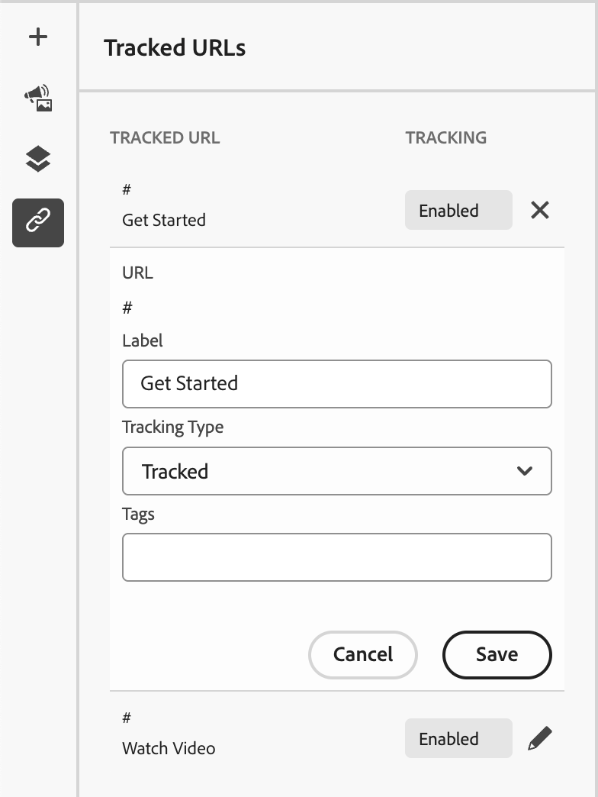
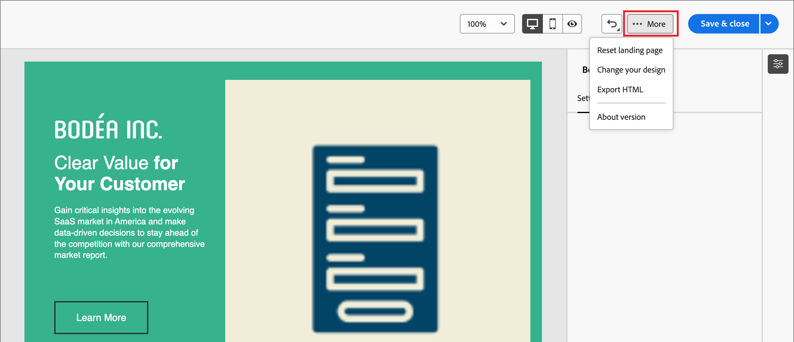

# ランディングページのデザイン

[ ランディングページを作成した後](./landing-pages-create-publish.md#create-landing-page)、ビジュアルデザインスペースを使用して、ページ内の構造コンポーネントとコンテンツコンポーネントをオーサリングします。

## 構造とコンテンツの追加 {#structure-content-landing-page}

{{$include /help/_includes/content-design-components-prime.md}}

### カスタム CSS を追加 {#add-custom-css}

ランディングページのデザインスペース内で、独自のカスタム CSSを直接追加できます。 カスタム CSSを使用して、高度で特定のスタイルを適用し、コンテンツの外観をより柔軟に制御できます。 画像、ボタン、テキストなどのコンポーネントを含める前に、この最高レベルのスタイル設定を追加することをお勧めします。

キャンバス内に少なくとも1つのコンテンツコンポーネントがある場合は、左側のナビゲーションツリーで&#x200B;**[!UICONTROL Body]** コンポーネントを選択して、カスタム CSS エディターにアクセスします。

{width="800" zoomable="yes"}

手順、構文ルール、およびトラブルシューティングについては、[ コンテンツ用カスタム CSSの追加](./design-custom-css.md)を参照してください。

### アセットの追加 {#add-assets}

ビジュアルデザイン領域で、左側のナビゲーションバーの&#x200B;_Assets_ （）アイコンを選択し、[!DNL Marketo Optimizer] アセットライブラリから画像アセットを参照して選択します。

画像アセットを選択、置換、またはアップロードする手順については、[ コンテンツのオーサリングにアセットを使用](./digital-asset-management.md#assets-authoring)を参照してください。

### フォームを追加 {#add-forms}

{{$include /help/_includes/content-design-add-forms.md}}

### レイヤー、設定、スタイルの移動 {#navigate-layers-settings-styles}

{{$include /help/_includes/content-design-navigation.md}}

### コンテンツのパーソナライズ {#personalize-content}

[!DNL Marketo Optimizer]は、パーソナライゼーションにHandlebars構文を使用しています。 ランディングページが表示されると、トークンは各訪問者のプロファイルデータの値に置き換えられます。

_パーソナライゼーションを追加するには&#x200B;:_

1. テキストコンポーネントを選択し、ツールバーの「_パーソナライゼーションを追加_」（）アイコンをクリックします。
1. パーソナライゼーションダイアログで、左側のスキーマツリーを参照し、属性を選択します。 対応するHandlebars式が挿入されます。
1. 必要に応じて、欠落しているデータを処理するフォールバック値を追加します。
1. **[!UICONTROL 確認]**&#x200B;または&#x200B;**[!UICONTROL 挿入]**&#x200B;をクリックします。 式がフィールド内にインラインで表示されます。

式エディターツールと構文について詳しくは、[Personalization エディター](./personalization-expressions.md)を参照してください。

### リンクされたURL トラッキングを編集 {#linked-url-tracking}

{{$include /help/_includes/content-design-links.md}}

{width="400"}

**[!UICONTROL トラッキングタイプ]**&#x200B;を使用して、リンクのトラッキングを制御します。

* **[!UICONTROL トラッキング済み]** - リンク URLでトラッキングをアクティブ化します。
* **[!UICONTROL なし]** - リンク URLのトラッキングをアクティブ化しません。

### 作品を保存 {#save-your-work}

いつでも&#x200B;**[!UICONTROL 保存]**&#x200B;をクリックして、ドラフト ランディングページを保存します。

引き続きドラフトページを編集できます。 ページを表示し、電子メールまたはSMS メッセージでリンクできるようにする準備ができたら、ページを公開できます。

### 表示オプション {#view-options}

ビジュアルデザイン分野で利用可能な表示およびコンテンツ検証オプションを活用します。

* プリセットのズームオプション全体でコンテンツをズームイン/ズームアウトします。

* デスクトップ、モバイル、またはテキストのみ/プレーンテキストのコンテンツ表示を切り替えます。
  * デバイス間でコンテンツをプレビューするには、_表示_ アイコンをクリックします。
  * すぐに使えるデバイスのいずれかを選択するか、カスタムディメンションを入力してコンテンツをプレビューします。

### 詳細オプション {#more-options}

ビジュアルデザインスペースの上部にある「_[!UICONTROL その他…]_」メニューから、次の操作を実行できます。

{width="500"}

* **[!UICONTROL ランディングページをリセット]** – このオプションをクリックすると、ビジュアルデザインキャンバスが空白のスレートに消去され、ページコンテンツの作成が再開されます。
* **[!UICONTROL デザインを変更]** - _[!UICONTROL メインのランディングページの作成]_&#x200B;のホームページに戻ります。 そこから、別のテンプレートを選択してデザインプロセスを再開するか、空白のキャンバスでページをゼロからデザインするかを選択できます。
* **[!UICONTROL HTMLを書き出し]** - ビジュアルキャンバスのコンテンツを、zip ファイルとしてパッケージ化されたHTML形式でローカルシステムにダウンロードします。
