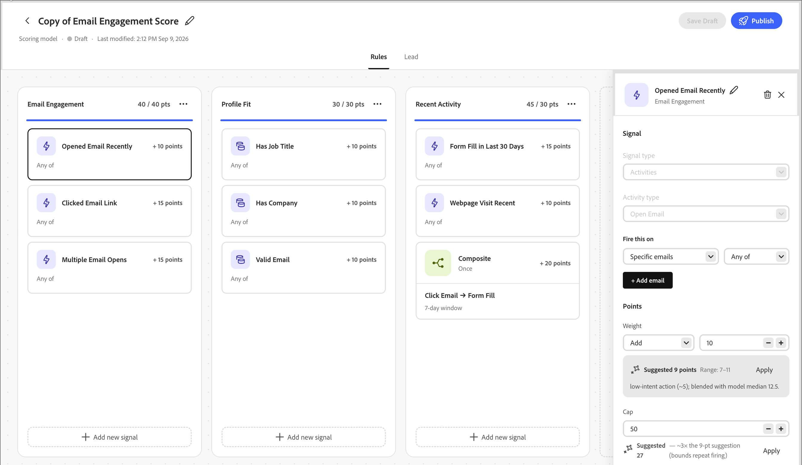

# スコアリングスタジオ

スコアリングスタジオには、モデルリスト、各モデルの編集可能なキャンバス、[同僚チャットインターフェイス ](../agents/chat-interface.md)が含まれます。 カンバスを使用してディメンションやシグナルを直接確認または調整し、Coworkerは自然言語の変更を提案し続けます。 プロンプトからモデルを作成する方法について詳しくは、[_カスタムスコアリングモデルの作成_](../agents/lead-scoring-model.md)&#x200B;を参照してください。

## モデルリスト {#model-list}

モデルリストは、Scoring Studioのランディングビューです。 [!DNL Marketo Optimizer] インスタンス内のすべてのスコアリングモデルが、テーブル内の行として、またはグリッドビューに切り替えるとカードとして表示されます。

| 列 | 説明 |
| --- | --- |
| 名前 | モデル名を選択してキャンバスで開きます。 |
| ステータス | _[!UICONTROL アクティブ]_、_[!UICONTROL ドラフト]_、または&#x200B;_[!UICONTROL アーカイブ]_。 |
| ディメンション | モデル内のディメンションの数。 |
| シグナル | モデル内のシグナルの数。 |
| 最終変更日 | モデルが最後に変更された日付 |
| 最終更新者 | モデルを最後に変更した人物。 |
| 作成日 | モデルの作成日。 |
| 作成者 | モデルを作成した人物。 |

{width="800" zoomable="yes"}

検索フィールドを使用して、名前でモデルを検索するか、ステータスでリストをフィルタリングします。 行の&#x200B;**[!UICONTROL 詳細メニュー]**&#x200B;から&#x200B;**[!UICONTROL 編集]**、**[!UICONTROL 複製]**、**[!UICONTROL アーカイブ]**&#x200B;または&#x200B;**[!UICONTROL 削除]**&#x200B;をモデルとして選択します。

アクティブなモデルは読み取り専用です。 変更するには、複製し、複製を編集します。 次に、元のコピーをアーカイブし、変更したコピーを公開します。

## モデルキャンバス {#model-canvas}

モデル名を選択すると、キャンバス上でモデル名が開きます。 開いている各モデルは独自のタブとして表示されるため、複数のモデルを使用して作業できます。 キャンバスは、**[!UICONTROL ルール]**&#x200B;と&#x200B;**[!UICONTROL リード]**&#x200B;を含むタブに整理されています。

**[!UICONTROL ルール]** タブでは、モデル内のすべてのディメンションがキャンバスの列になります。 各列ヘッダーには、ディメンション名とそのキャップに対するポイントの合計（例：`20 / 30 pts`）が表示され、信号の貢献度ポイントとして入力されるプログレスバーが表示されます。

{width="700" zoomable="yes"}

各ディメンション内では、アクティビティに依存しない属性ベースのシグナルに対して、すべてのシグナルが、名前、ポイント値、および一致する頻度（例：`1 time / day`）または`Static`を示すカードとして表示されます。

Coworkerが複数のアクティビティにまたがるパターンを検出すると、それらを組み合わせて、すべての条件を要約した単一の複合シグナルカードにすることができます。

## シグナルの設定 {#configure-signal}

シグナルを確認または変更するには、次の手順に従います。

1. 「**[!UICONTROL ドラフトを編集]**」を選択します。

1. カンバス上の信号カードを選択します。

   プロパティパネルがカンバスの右側に開きます。

   {width="700" zoomable="yes"}

1. **[!UICONTROL 編集]** アイコン （）を選択し、信号プロパティを更新します。

   * **[!UICONTROL Signal]**&#x200B;で、シグナルの種類（アクティビティまたは属性）と、スコアを算出する特定のアクティビティまたは属性を確認します。

   * 「**[!UICONTROL これを]**&#x200B;に実行」で、一致する必要がある条件を設定します。

     特定のページなど、使用する項目を追加します。また、**[!UICONTROL いずれかの]**&#x200B;または&#x200B;**[!UICONTROL すべての]**&#x200B;の条件はtrueである必要があります。

   * **[!UICONTROL Points]**&#x200B;の下で、シグナルが貢献するポイント数を設定します。

     オプションで、**[!UICONTROL 上限]**&#x200B;を設定して、1人あたりのポイント数を制限します。 同僚は、モデル内の他の信号に基づいて、提案された点範囲を表示します。

   * アクティビティベースのシグナルの場合、シグナルがポイントを付与する前に必要な&#x200B;**[!UICONTROL 頻度]**&#x200B;を設定します。

     オプションで、指定された日数が経過した後に信号のポイントを減らす&#x200B;**[!UICONTROL 減衰]** パーセンテージを設定します。

   * アクティビティが何回発生しても、同じアクションを2回スコアリングしない&#x200B;**[!UICONTROL オプションを有効にして、1人につき1回だけポイントを付与します。]**

     アクティビティが発生するたびにポイントを付与するオプションを無効にします。 この設定はデフォルトでオンになっています。

1. **[!UICONTROL 保存]**&#x200B;を選択して変更を適用し、キャンバスに戻ります。

## リードセグメント {#lead-segment}

あらゆるスコアリングモデルは、Scoring Studio内で定義したルールではなく、既存の人物リストを参照して、1つのリードセグメントをスコアリングします。 Coworkerがモデルを作成すると、一致するリストを選択するか、新しいリストを作成します。

リストを変更するには、「**[!UICONTROL リード]**」タブを選択し、リードセグメントの横にある「**[!UICONTROL 変更]**」を選択します。

{width="700" zoomable="yes"}

リードセグメントは、次のいずれかのリストタイプを使用します。

* **静的リスト** — リストの作成時にキャプチャされた固定セット。
* **スマートリスト** — モデルが実行されるたびにメンバーシップルールを再評価するリスト。そのため、セグメントは常にリスト条件を反映します。

モデルのプレビューには、セグメント名、そのメンバー数、およびリストを直接開く&#x200B;**[!UICONTROL 人物リストを表示]** リンクが表示されます。 リストの管理について詳しくは、[_ユーザーリスト_](../audiences/people-lists.md)&#x200B;を参照してください。

参照リストが空であるか、後で削除された場合、モデルはオーディエンス全体にフォールバックするのではなく、スコアリングを停止します。 有効な空でないリストを割り当てるまで、リードはスコアリングされません。

リードセグメントの下に、**[!UICONTROL スコアフィールド名]** カードは、モデルがスコアを書き込むリード属性を示します。 デフォルトでは、フィールド名はモデル名と一致します。 **[!UICONTROL 編集]**&#x200B;を選択して名前を変更します。

## 公開とスケジュール {#publish-schedule}

モデルの準備ができたら、**[!UICONTROL 公開]**&#x200B;を選択します。 モデルがオーディエンスをスコア化する頻度（日単位、週単位、月単位）を選択します。

スコアリングフィールドを[!DNL Marketo Optimizer]が自動的にプロビジョニングする方法など、完全な公開プロセスについては、[_スコアリングモデルの公開_](../agents/lead-scoring-model.md#publish-model)&#x200B;を参照してください。
