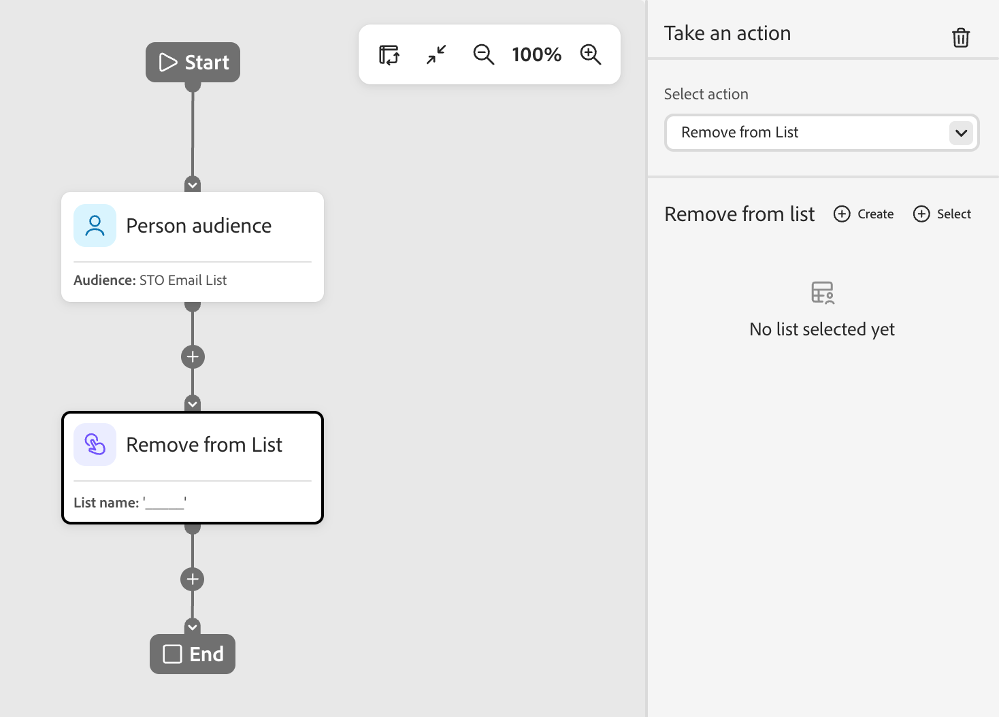
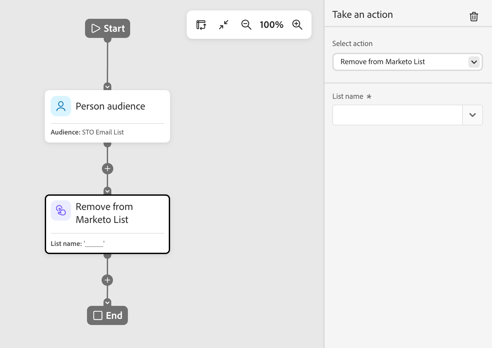

# アクションノードを作成

個人ジャーニーでは、ノードパス上のすべてのユーザーに変更を適用する場合に、人物に対するアクションを使用します。

## アクションと制約 {#actions}

| アクション | 制約 |
| ------ | ----------- |
| **[!UICONTROL 宛先に対してアクティブ化]** | <li>静的リストの選択または作成 <li>リストにアクティブ化された宛先がない場合は、リストを1つ以上の宛先にアクティベートします |
| **[!UICONTROL ユーザーをジャーニーに追加]** | <li>スケジュール済みジャーニーまたはライブジャーニーの選択 <li>ターゲットジャーニーのオーディエンス基準が適用されない |
| **[!UICONTROL リストに追加]** | <li>新しい静的リストを作成するか、既存の静的リストを選択します |
| **[!UICONTROL Marketo Engage リストに追加]** | <li>Marketo Engageで静的リストを選択する |
| **[!UICONTROL データ値の変更]** | <li>人物属性を選択 <li>新しい値を設定 |
| **[!UICONTROL プログラムのステータスの変更]** | <li>プログラムを選択<li>新しいステータスを選択 |
| **[!UICONTROL ウェビナーメンバーのステータスを変更]** | <li>プログラムを選択<li>新しいステータスを選択 |
| **[!UICONTROL リストから削除]** | <li>静的リストを選択 <li>メンバーでない場合は人物をスキップ |
| **[!UICONTROL Marketo Engage リストから削除]** | <li>Marketo Engageで静的リストを選択する <li>メンバーでない場合は人物をスキップ |
| **[!UICONTROL ジャーニーからユーザーを削除]** | <li>ライブジャーニーの選択 <li>現在ターゲットジャーニーのメンバーではない場合、人物をスキップします |
| **[!UICONTROL Marketo Engage キャンペーンをリクエスト]** | <li>Marketo Engage キャンペーンの選択 |
| **[!UICONTROL 電子メールを送信]** | <li>AIを活用してパーソナライズされた電子メールを作成、編集、利用 <li>配信時間の最適化（オプション） |
| **[!UICONTROL WhatsAppを送信]** | <li>WhatsApp メッセージの選択 |

<!-- 
removed? | **[!UICONTROL Change Program Data]** | <li>Select program attribute <li>Set new value | 
-->

## アクションノードの追加 {#add-an-action-node}

1. ジャーニーキャンバスに移動します。

1. パスのプラス（**+**）アイコンをクリックし、**[!UICONTROL アクションを実行]**&#x200B;を選択します。

   {width="200"}

1. 右側のノードプロパティで、リストからアクションを選択し、アクションの値を設定します。

+++宛先に対してアクティベート

このアクションを使用すると、静的リストにユーザーを追加し、そのリストをジャーニーから直接宛先にアクティベートできます。 既存の静的リストを使用するか、ジャーニー専用の静的リストを作成できます。

>[!PREREQUISITES]
>
>_宛先_ ジャーニーノードに対するアクティブ化を設定する前に、[!DNL Marketo Optimizer] サンドボックスに1つ以上の[設定された宛先](../audiences/destinations.md)が必要です。

{width="450"}

「**[!UICONTROL リストに追加]**」で、次のいずれかのオプションを選択します。

* **[!UICONTROL 作成]** – 新しい静的リストを作成し、そのリストにユーザーを追加します。 このリストは、**[!UICONTROL ユーザーリスト]**&#x200B;ですぐに利用できます。

  リストの親プログラムを選択し、**[!UICONTROL 名前]** （必須）と&#x200B;**[!UICONTROL 説明]** （オプション）を入力します。 「**[!UICONTROL 作成]**」をクリックして、ノードの新しいリストを追加します。

  {width="375"}

* **[!UICONTROL 選択]** — ノードに到達するユーザーを追加する既存の静的リストを選択します。

  既存の静的リストのチェックボックスを選択し、**[!UICONTROL 保存]**&#x200B;をクリックします。

  {width="700" zoomable="yes"}

ノードに到達したユーザーは選択した静的リストに追加されますが、リストが宛先にアクティベートされるまでアクションは完了しません。

* 選択したリストが既にアクティブ化されている場合、その宛先は&#x200B;**[!UICONTROL 宛先]**&#x200B;の下に表示され、アクションの準備が整っています。
* それ以外の場合は、_少なくとも1つの宛先が必要です_ メッセージが表示されます。 「**[!UICONTROL 宛先にリストをアクティブ化]**」をクリックし、宛先を選択して「**[!UICONTROL 保存]**」をクリックします。 確認ダイアログで「**[!UICONTROL アクティブ化]**」をクリックします。

{width="600" zoomable="yes"}

アクティベーションが完了すると、宛先が&#x200B;**[!UICONTROL 宛先]**&#x200B;の下に表示され、アクションの準備が整います。 必要に応じて、リストを追加の宛先にアクティベートできます。

ノードに到達したユーザーは選択した静的リストに追加され、選択した宛先にアクティベートされるので、そのノードはその宛先オーディエンスに追加され、その後、オーディエンスがフィードする任意のキャンペーンに追加されます。

+++

+++[!UICONTROL &#x200B; ユーザーをジャーニーに追加]

このアクションを使用して、他のスケジュール済みジャーニーまたはライブジャーニーにユーザーを追加します。 このアクションを通じて追加された人物は、ターゲットジャーニーのオーディエンスにすぐに追加されます。ターゲットジャーニーのオーディエンス条件は適用されません。

{width="450"}

+++

+++[!UICONTROL &#x200B; リストに追加]

Marketo Optimizerの静的リストにユーザーを追加するには、このアクションを使用します。

{width="450"}

次のいずれかのオプションを選択します。

* **[!UICONTROL 作成]** – 新しい静的リストアセットを作成し、それにユーザーを追加します。 このリストは、Marketo Optimizerの他のアセットですぐに使用できます。
* **[!UICONTROL 選択]** — ノードに到達するユーザーを追加する既存の静的リストアセットを選択します。

+++

+++[!UICONTROL Marketo Engage リストに追加]

Marketo Engageの静的リストにユーザーを追加するには、このアクションを使用します。

{width="450"}

+++

+++[!UICONTROL &#x200B; データ値の変更]

このアクションを使用して、人物レコードの属性の値を更新します。 属性を選択し、新しい値を設定します。

>[!TIP]
>
>属性の値をクリアするには、値を`NULL`に設定します。

{width="450"}

+++

+++[!UICONTROL &#x200B; プログラムのステータスの変更]

Marketo Engage プログラムのユーザーのステータスを変更するには、このアクションを使用します。 プログラムを選択し、新しいステータスを選択します。

{width="450"}

+++

+++[!UICONTROL &#x200B; ウェビナーメンバーのステータスを変更]

このアクションを使用して、インタラクティブウェビナーに関連するユーザーのステータスを変更します。 ウェビナーを選択し、新しいステータスを選択します。

{width="450"}

+++

+++[!UICONTROL &#x200B; リストから削除]

Marketo Optimizerの静的リストからユーザーを削除するには、このアクションを使用します。 ユーザーが現在リストのメンバーではない場合、そのユーザーのアクションはスキップされます。

{width="450"}

+++

+++[!UICONTROL Marketo Engage リストから削除]

Marketo Engageの静的リストからユーザーを削除するには、この操作を使用します。 ユーザーが現在リストのメンバーではない場合、そのユーザーのアクションはスキップされます。

{width="450"}

+++

+++[!UICONTROL &#x200B; ジャーニーからユーザーを削除]

このアクションを使用して、他のライブ人物ジャーニーから人物を削除します。 その人物はターゲットジャーニーからすぐに削除され、それ以上のアクションは実行されません。 ユーザーが現在ターゲットジャーニーのメンバーではない場合、そのユーザーのアクションはスキップされます。

{width="450"}

+++

+++[!UICONTROL Marketo Engage キャンペーンをリクエスト &#x200B;]

このアクションを使用して、接続されたMarketo Engage インスタンスでリクエストキャンペーンにユーザーを追加します。 リクエストするMarketo Engage キャンペーンを選択します。

{width="450"}

+++

+++[!UICONTROL 電子メールを送信]

このアクションを使用して、オプトインしたユーザーにメールを送信します。 購読解除、リストへの登録をブロック、メール配信の停止、マーケティング配信の停止を受けたユーザーは、このアクションをスキップします。

{width="450"}

電子メールを作成したり、既存の電子メールを編集したり、AIによってパーソナライズされた電子メールを使用したりできます。 電子メールの作成と編集について詳しくは、[電子メールチャネル &#x200B;](./email-channel.md)を参照してください。 既存のメールのペルソナベースのバリエーションを生成するには、[&#x200B; ペルソナ別のメールコンテンツのパーソナライズ &#x200B;](../agents/personalize-content.md)を参照してください。

[送信時間の最適化](./email-send-time-optimization.md)を使用して、各プロファイルがエンゲージする可能性が最も高いタイミングを予測し、メール配信のタイミングをパーソナライズできます。

+++

+++[!UICONTROL WhatsAppを送信]

このアクションを使用して、WhatsApp メッセージを送信します。 ビジュアルデザイン空間でWhatsApp メッセージを作成、パーソナライズ、プレビューできます（[WhatsApp オーサリング &#x200B;](../content/whatsapp-authoring.md)を参照）。

{width="450"}

+++
