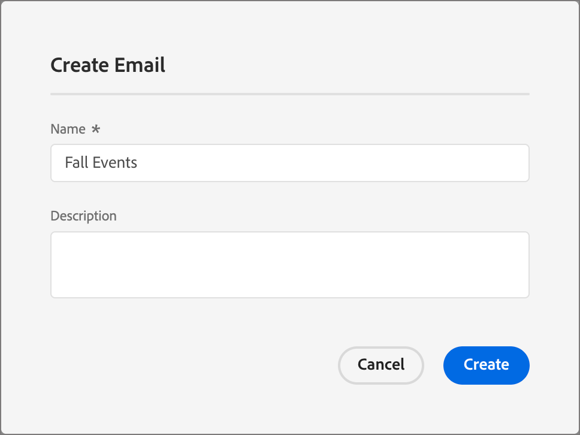

# ジャーニーへのメールの追加

[!DNL Adobe Marketo Optimizer]では、最新のエンタープライズ向けメール作成および配信エクスペリエンスをB2B マーケターに提供しています。

>[!NOTE]
>
>初めて電子メールを送信する場合は、[電子メールの配信品質](../start/email-deliverability.md)と必要な[電子メールチャネル ](../admin/email-channel-configuration.md)が設定されていることを確認してください。

<!-- 
* **Email channel configurations** - Manage the sender identity, reply behavior, marketing vs. transactional message types, and tracking.
* **Email deliverability controls** - Set up your email deliverability channel, including subdomain delegation (Fully Delegated and CNAME methods), DMARC, SPF/DKIM auto-configuration, and shared IP pool support.
* **Send Email action** - From a journey, add a _Send email_ action node, including personalization using profile attributes (Handlebars syntax).
* **Visual drag-and-drop email design tools** -  Design your email content with structures, content components, themes, dark-mode support, and reusable visual fragments.
* **Marketo Design Studio assets** — Choose images and assets from a one-time copy of your Marketo Engage asset library directly inside the email canvas.
* **Reusable templates and fragments** — Save common headers, footers, CTAs, and full email layouts and reuse them across journeys.
* **Role-Based Access Control (RBAC)** — Apply granular permissions for creating, editing, approving, and sending email. 
-->

## 現在の制限事項 {#limitations}

* **テストプロファイル、コンテンツのシミュレート、プルーフの送信**&#x200B;は、このリリースでは使用できません。 LitmusのレンダリングとSpamAssassin ベースのスパムレポートは、一般提供のロードマップに掲載されています。
* **アカウントレベルのパーソナライゼーションとカスタムオブジェクトデータ**&#x200B;は、このリリースでは使用できません。 プロファイル属性の利用：
* 既存のMarketo Engage テンプレートの&#x200B;**Velocity-to-Handlebars自動移行**&#x200B;は、一般公開されます。
* **電子メールに関するコメントと共同作業** （インラインコメント、@mentions、リクエストとレビューのワークフロー）は、今後のリリースで出荷されます。
* **AEM Assets、AEM コンテンツフラグメント、Adobe Express**&#x200B;の統合は、_迅速フォローアップ_&#x200B;のロードマップに含まれています。

## 主要概念 {#key-concepts}

個人ジャーニーのメールを作成し、メールコンテンツをオーサリングする前に、次の概念を確認します。

| 概念 | [!DNL Adobe Marketo Optimizer]内 |
| ------- | ---------------------- |
| **_電子メールデザインスペース_** | メールコンテンツの作成に使用されるビジュアルキャンバスとデザインツール。 ドラッグ&amp;ドロップ操作のレイアウトコンポーネント、テンプレート、フラグメント、テーマ、パーソナライゼーションエディターが含まれます。 |
| **_テンプレート_** | 新しいメールの作成に使用できる、再利用可能なメールレイアウト。 これは、Adobeが提供するビルトインサンプルテンプレートまたはチームが作成したカスタムビルトインテンプレートのいずれかです。 |
| **_ビジュアルフラグメント_** | 複数のメールに挿入できる、再利用可能なコンテンツブロック（ヘッダー、フッター、CTA、免責条項など）。 フラグメントを更新すると、フラグメントを使用するすべての電子メールに変更が反映されます。 |
| **_テーマ_** | 再利用可能なスタイルプリセット（色、タイポグラフィ、間隔、ボタンスタイル）がメールに適用されます。 |
| **_Personalization トークン_** | Handlebars式（例：`{{profile.firstName}}`）は、送信時に、各受信者のプロファイルデータを使用して解決されます。 |
| **_メールアクションを送信_** | チャネル設定とメールコンテンツを使用してメールを配信するジャーニーアクションノード。 |

## ジャーニーからのメールの追加

ジャーニーから電子メールを送信するには、[ アクションを実行&#x200B;_ノード_&#x200B;を追加し、電子メールを送信するように設定します](action-nodes.md#add-an-action-node)。

1. ジャーニーキャンバスで、**+** アイコンをクリックし、**[!UICONTROL アクションを実行]**&#x200B;を選択します。

1. 右側のノードプロパティで、アクションを&#x200B;**[!UICONTROL メールを送信]**&#x200B;に設定します。

   {width="500"}

1. メールのソースを選択：

   * **電子メールの作成/編集** – 電子メールデザイン領域で、件名、送信者情報、電子メール本文を含む電子メールコンテンツを定義するには、このオプションを選択します。

   * **[!UICONTROL AIでパーソナライズされた電子メールを使用する]** - （_Betaでは利用できません_）電子メールデザインスペースでAIで生成された電子メールを絞り込むには、このオプションを選択します。 これらのメールは、AIを活用して受信トレイを最適化されており、オファーやCTAにおいて、顧客の要約と回答が反映されています。

1. 「**[!UICONTROL メールを作成]**」をクリックします。

1. _[!UICONTROL メール作成]_ ダイアログで、一意の&#x200B;**[!UICONTROL 名前]** （必須）と&#x200B;**[!UICONTROL 説明]** （オプション）を入力します。

   {width="400"}

1. 「**[!UICONTROL 作成]**」をクリックします。

オプションの[送信時間の最適化](email-send-time-optimization.md)では、電子メールの作成後にジャーニーアクションノードを設定します。

## メールプロパティとアクションを定義 {#define-email-properties}

「_[!UICONTROL メールを送信]_」ノードのメールを作成すると、メールページが開きます。 右側のノードプロパティで「**[!UICONTROL メールを編集]**」をクリックすると、メールの作成後にこのページにアクセスすることもできます。

1. （オプション）「**[!UICONTROL プロパティ]**」タブに、電子メール用に取得する記述情報を入力します。

1. 「**[!UICONTROL アクション]**」タブを選択し、メールの機能設定を完了します。

   * **[!UICONTROL 電子メール]** – 使用する&#x200B;**[!UICONTROL 電子メールチャネル設定]**&#x200B;を選択または作成します。

     これは、送信者ID、返信先アドレス、サブドメイン、IP プール、メールタイプ（マーケティングまたはトランザクション）、トラッキングを定義する、再利用可能なメール配信設定のセットです。 _表示_ アイコンをクリックして、選択した設定の設定を確認します。

     管理者は、[電子メールチャネル設定](../admin/email-channel-configuration.md)で設定を作成します。

   * **[!UICONTROL ビジネスルール]** - （オプション）ルールセットを選択して、メールアクションにキャッピングルールまたはサイレントアワーのルールを適用します。

     ビジネスルールと、チャネル通信のルールセットを定義およびアクティブ化する方法について詳しくは、[_ビジネスルール_](../admin/business-rules.md)&#x200B;を参照してください。

   * **[!UICONTROL アクションの追跡]** – 電子メールで追跡するアクションのチェックボックスをオンにします。

   {width="600" zoomable="yes"}

1. 「**[!UICONTROL コンテンツを編集]**」をクリックするか、「**[!UICONTROL コンテンツ]**」タブを選択します。

1. 電子メールの件名フィールドに表示する&#x200B;**[!UICONTROL 件名]** テキストを入力します。

   _パーソナライズ_ アイコン（）をクリックして、フィールドでパーソナライゼーショントークンを使用します。

1. （オプション）公開プロセス中にメール HTMLのサイズを小さくするには、「**[!UICONTROL HTML サイズを最適化]**」チェックボックスをオンにします。

   これにより、100 KB を超えるメッセージを切り捨てる Gmail などのクライアントでのメールクリッピングを防ぐことができます。 詳しくは、[_電子メールのHTML サイズの最適化_](#optimize-html-size)&#x200B;を参照してください。

1. **[!UICONTROL メール本文を編集]**&#x200B;をクリックしてビジュアルデザインツールにアクセスし、[ コンテンツの作成を開始](../content/email-authoring.md)します。

   または、**[!UICONTROL コードエディター]**&#x200B;をクリックして、プレーンHTMLで独自のコンテンツをコーディングすることもできます。 既存のHTMLをメールデザインに再利用する場合は、それをコピーしてエディターに貼り付けることができます。

### アラートの確認 {#alerts}

[!DNL Adobe Marketo Optimizer]は、メールページの右上隅に問題を表示します。 ジャーニーをアクティブ化する前に、すべてのエラーを解決します。 警告は推奨事項のみです。

**エラー** （ジャーニーのアクティブ化を防止）:

* 差出人名が空です
* 件名がありません
* メールコンテンツが空です

**警告** （推奨事項）:

* メール本文にオプトアウトリンクが存在しません
* HTMLのテキストバージョンが空です
* 空のリンクが検出されました
* 電子メールが100 Kを超えています

## メールの HTML サイズの最適化 {#optimize-html-size}

>[!CONTEXTUALHELP]
>id="ajo-b2b-prime_email_minification"
>title="HTML サイズを削減"
>abstract="このオプションを有効にすると、公開時に不要な空白、インデントおよび必須ではないコメントが削除され、メールの HTML が圧縮されます。 これにより、100 KB を超えるメッセージを切り捨てる Gmail などのクライアントでのメールクリッピングを防ぐことができます。"

[!DNL Marketo Optimizer] を使用すると、公開プロセス中に不要な空白、インデント、必須ではないコメントが削除され、メール の HTML バージョンが圧縮されます。 HTML サイズを小さくすると、次の操作を実行できます。

* **メールクリッピング**&#x200B;を回避する - Gmail などの一部のメールクライアントでは、100 KB を超えるメッセージが切り捨てられ、受信者が完全なコンテンツを表示できなくなります。
* 受信者のインボックスでの&#x200B;**メールの読み込み時間**&#x200B;を改善する。
* **配信品質**&#x200B;を向上させ、帯域幅の使用を削減する。

この最適化は自動的に適用されません。_[!UICONTROL コンテンツ]_ タブで有効にする必要があります。

<!--  -->

>[!IMPORTANT]
>
> HTML サイズの削減は、公開時にのみ適用されます。

この最適化は、メールクライアントに対して安全です。

* MSO／Outlook の条件付きコメントが保持されます。
* 実際のコンテンツ、画像、ビデオは変更されません。

>[!NOTE]
>
>メールサイズの削減は、メールの元の HTML 構造によって異なります。 コンテンツが既にコンパクトである場合や、メールペイロードが非常に大きい場合、削減は最小限に抑えられ、すべてのケースでクリッピングを完全に防ぐことはできないことがあります。

<!-- 
Proof and simulate workflows are not available in this release. See [Current limitations](#limitations).

### Test HTML size optimization {#optimize-html-proof}

If you have enabled the [HTML size optimization](#optimize-html-size) option, you can evaluate its impact before publishing when sending proofs. Follow the following steps.

1. In the email design space, click the _Issues_ icon on the top right. If the rendered email size exceeds 100 KB, a message is displayed to warn you that this may cause truncation in some email clients.

1. Click **[!UICONTROL Simulate content]**.

1. To test the optimized version, click the **[!UICONTROL Send proof]** button and select the **[!UICONTROL Optimize HTML size]** option. This will send a proof with the reduced HTML size to your test recipients.

    >[!NOTE]
    >
    >This setting is independent from the email editor — the proof reflects what you select in the proof, regardless of whether the option is enabled or disabled in the email itself.

1. Select the test recipients and click **[!UICONTROL Send proof]**.

1. Back in the **[!UICONTROL Simulate]** screen, click the **[!UICONTROL View Proof]** button.

1. Click the _Information_ icon next to the status of the proof.

   The optimization details are displayed in a pop-up window, including the original HTML size, the optimized HTML size, and the size reduction percentage.
    
    Use this information to validate the optimized output and confirm the email stays within the recommended 100 KB threshold before publishing.

-->
