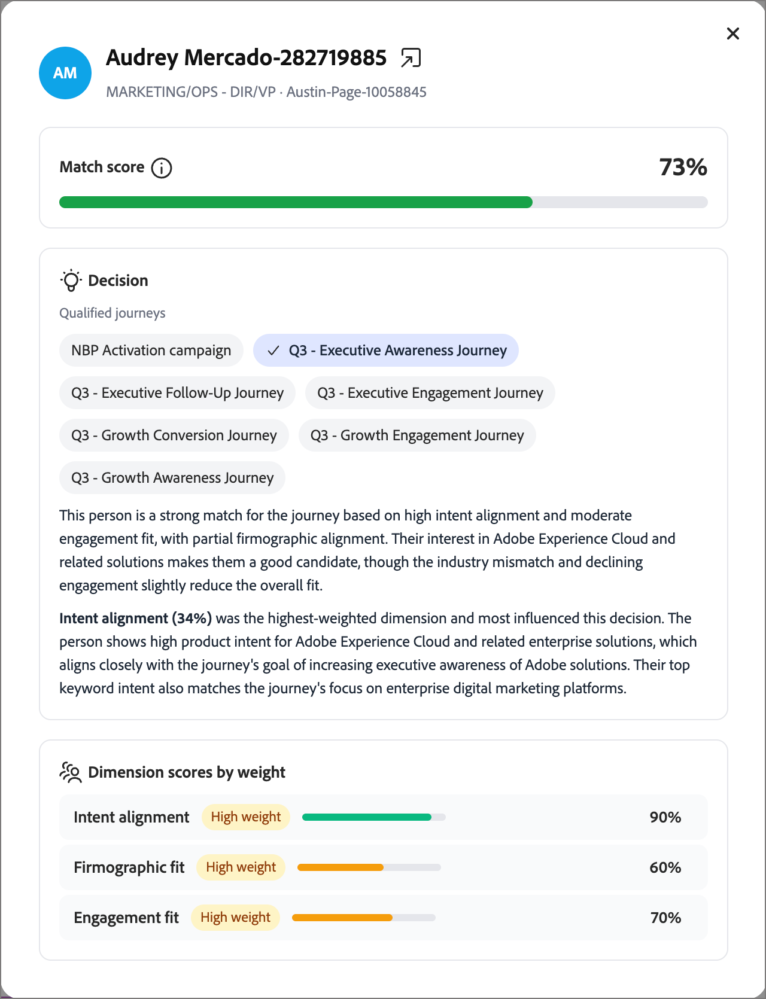

# ジャーニー交通制御

ジャーニー交通制御（JTC）では、オーディエンスが重複した場合に、最適なジャーニーを優先します。 JTCが有効な複数のジャーニーの資格を得ると、AI モデルはそれらを各候補に対して評価し、最適なジャーニーに追加して、他の候補から除外します。

>[!NOTE]
>
>ジャーニーのトラフィック制御は、[!DNL Journey Optimizer B2B Edition]と[!DNL Marketo Optimizer]の両方で同じように機能します。 機能とロジックは同じですが、UIに小さな違いしかありません。 このページの情報は[!DNL Marketo Optimizer] エクスペリエンスを反映しています。

ユーザーがジャーニーを完了すると、そのユーザーが選定されたままの残りのジャーニーについて再評価されます。 JTCは、それらを次の最適なジャーニーに追加します。 これにより、重複する複数のジャーニーに同じ人物が同時に割り当てられるのを防ぎ、各コンタクトが最も関連性の高いエクスペリエンスを最初に受け取るようにします。

>[!NOTE]
>
>現在、JTCが選択したジャーニーに一度に割り当てることができるジャーニーは1つのみです。 ユーザーが複数のジャーニーに同時に登録できるようにする管理者設定オプションは、今後のリリースで計画されます。

## スコア寸法 {#scoring-dimensions}

このモデルは、7つのスコアリングディメンションにわたって各個人のジャーニーの組み合わせを評価します。 各ディメンションは個別にスコアリングされ、設定した重みに従って組み合わされて、オーディエンスとジャーニーの最終的な一致確率を生み出します。 最も強い一致を持つジャーニーが選択されます。

| 寸法 | 評価するもの |
|---|---|
| インテントの調整 | 行動のインテントシグナル：キーワード検索、製品ページへの訪問、コンテンツのダウンロード、メールの開封/クリックスルー、価格ページのアクティビティ |
| Audience fit | ユーザーがジャーニーの[&#x200B; ターゲットオーディエンス &#x200B;](./person-audience-node.md)とどの程度一致しているか。 |
| ペルソナフィット | ユーザーの役割/[&#x200B; ペルソナ &#x200B;](../audiences/personas.md)とジャーニーの間の調整。 |
| 企業特性フィット | 企業レベルの属性（業界、規模、収益など）。 |
| デモグラフィックマッチ | 個人レベルのデモグラフィック属性： |
| サイコグラフィック調整 | 態度/嗜好ベースの調整： |
| エンゲージメント適合性 | ユーザーの[&#x200B; エンゲージメント &#x200B;](../audiences/engagement-scores.md)の最新性と深さ。 |

データを持たないディメンションは自動的にスキップされるため、属性が欠落してもスコアリングがペナルティを受けることはありません。

>[!IMPORTANT]
>
>有意義な何かを行うには、少なくとも2つのジャーニーでJTCを有効にする必要があります。 単一のジャーニーで有効にすることは、競合するジャーニーがないので効果がありません。 2つ以上のジャーニーがJTC対応である場合にのみ、モデルは競合の解決を開始します。

## 前提条件 {#prerequisites}

ジャーニーのトラフィック制御が結果を生成する前に、次の点に留意してください。

* **レポートには、公開されたJTC対応ジャーニーが必要です。** 「_[!UICONTROL レポート]_」タブには、ジャーニートラフィック制御が有効になっているジャーニーが少なくとも1つ公開されるまで、データが表示されません。
* **シミュレーションには、インスタンス内に少なくとも1つの公開されたジャーニーが必要です。** シミュレーションでは、既にライブジャーニーにある[&#x200B; プロファイル &#x200B;](../audiences/people-lists.md)が評価されるので、プロファイルを描画するには、インスタンス内の少なくとも1つの公開されたジャーニーが必要です。 シミュレーション自体は、JTCを有効にする必要はありません（[_スコアリングのシミュレーション_](#simulate-scoring)&#x200B;を参照）。

## 基本を学ぶ {#get-started}

左側のナビゲーションで「**[!UICONTROL ジャーニートラフィックコントロール]**」を選択します。 表示されるページには、次の2つのタブがあります。

* **[!UICONTROL レポート]** — トラフィック制御の実行結果を表示します（JTCがライブジャーニーで実行された後にのみ入力されます）。
* **[!UICONTROL 設定]** — スコアリングディメンションを調整し、結果をシミュレートし、参加するジャーニーを選択します。

>[!IMPORTANT]
>
>ジャーニーのトラフィック制御を使用したことがない新規顧客の場合、_[!UICONTROL レポート]_ タブは空です。 レポートには、トラフィック制御が適用され、実行されたジャーニーのみが反映されます。 「_[!UICONTROL 設定]_」タブから開始します。

## 「設定」タブ {#configuration-tab}

「_[!UICONTROL 設定]_」タブには、2つのセクションがあります。**[!UICONTROL ディメンションスコアリングの調整]**&#x200B;と&#x200B;**[!UICONTROL ジャーニーの選択]**。

### ディメンションのスコアリングの調整 {#adjust-dimension-scoring}

このセクションでは、7つのディメンションのそれぞれが最終的なマッチスコアにどの程度貢献しているかを設定します。 各ディメンションは、**[!UICONTROL Off]**、**[!UICONTROL Low]**、**[!UICONTROL Medium]**&#x200B;または&#x200B;**[!UICONTROL High]**&#x200B;重要度に設定できます。 各カードに表示される割合は、すべての選択を組み合わせた後、そのディメンションの正規化された貢献度です。7つの重みは常に合計100%です。 1つのディメンションを上げると、他のディメンションが自動的に再正規化されるため、合計は100%に留まります。

「**[!UICONTROL 次にリセット]**」をクリックして、すべてのディメンションを均等な重みに戻します。

{width="800" zoomable="yes"}

### スコアリングのシミュレート {#simulate-scoring}

本番環境に重みをコミットする前に、トラフィック制御がこれらの変更にどのように反応するかをシミュレートできます。 シミュレーションでは、ジャーニーのトラフィック制御を有効にする必要はありません。 すでにライブジャーニーにあるプロファイルを評価し、トラフィック制御ロジックを適用します。これにより、選択した重みにもとづいて成果が適切かどうかを判断できます。

1. シミュレーションするプロファイルの数を選択します。

1. 「**[!UICONTROL スコアリングをシミュレート]**」をクリックします。

結果ヘッダーは、実行の概要を示します。

* **プロファイルが評価されました** — スコアリングされたプロファイルの数、およびジャーニーの数に基づいて評価されました。
* **Average conflicts/profile** — プロファイルあたりの競合ジャーニーの平均数。
* **平均一致スコア** – 選択したジャーニーの平均信頼度。

{width="700" zoomable="yes"}

概要の下には、各評価プロファイルが、選択したジャーニー、主要な根拠、インテントシグナル、マッチスコアを示すカードとして表示されます。 プロファイルを選択して、次の方法で詳細ビューを開きます。

* **一致スコア** – 全体の一致。ディメンション別に色分けされた分類が表示されます。
* **決定** – このユーザーが選定したジャーニー、選択されたジャーニー、およびその理由。
* **Dimensionの重み付けスコア** – 意思決定を促進したディメンションごとのスコア。基礎となるシグナルを示すために拡張可能です。

{width="450" zoomable="yes"}

結果に満足した場合は、次のことができます。

* ディメンションの重みを調整し、**[!UICONTROL 再実行]**&#x200B;をクリックしてシミュレーションを再実行します。

* 「**[!UICONTROL 本番環境に適用]**」をクリックして、重みを確定します。

  新しいトラフィック制御の決定は、新しい設定をすぐに使用します。過去の決定は影響を受けません。 テストした重みはメインの&#x200B;_[!UICONTROL 設定]_ タブに表示され、ライブ環境でトラフィック制御が評価されているジャーニーに使用されます。

重みを適用せずにページを離れることもできます。

<!--

This section does not appear in the staging environment

### Select journeys {#select-journeys}

The _[!UICONTROL Select journeys]_ section is where you choose which journeys participate in traffic control.

>[!IMPORTANT]
>
>Only draft journeys are available for selection. Traffic control cannot be enabled for a journey that is already live. When JTC is enabled for a journey and then that journey is published, it cannot be disabled.

-->

## ジャーニーのトラフィック制御の有効化 {#enable-traffic-control-journey}

2つ以上のジャーニーでジャーニートラフィック制御が有効になっていて、公開されている場合：

* これらのジャーニーの1つ以上に適格なユーザーは、プロファイルとジャーニーのメタデータに基づいて評価されます。
* JTC対応のジャーニーを一度に複数選択できる場合（例えば、5つ）、モデルは、その瞬間に最適なジャーニーを判断し、そのジャーニーのみに登録します。 彼らは他の者から差し出されている。
* その人は、そのジャーニーが完了するまで進みます。
* 完了すると、そのジャーニーはまだ選定されている残りのジャーニーに対して再評価され、次善のジャーニーに追加されます。その後、選定されたジャーニーが残らないまで繰り返されます。

### ドラフトジャーニーでJTCを有効にする {#enable-traffic-control-draft-journey}

ジャーニートラフィック制御は、_ドラフト_ ステータスの場合、個々のジャーニーで直接有効にできます。<!-- This is the same setting surfaced from the admin/configuration flow — enabling it in either place keeps the two in sync. -->

1. 左側のナビゲーションで、**[!UICONTROL マーケティング管理]**&#x200B;を展開します。

1. **[!UICONTROL マーケティング]**&#x200B;のリソースリストの右側で、**[!UICONTROL 人物ジャーニー]**&#x200B;を選択します。

1. ドラフトユーザージャーニーの名前をクリックして開きます。

1. **[!UICONTROL をクリック…右上に]**&#x200B;個を追加し、**[!UICONTROL ジャーニートラフィック制御の設定]**&#x200B;を選択します。

   {width="700" zoomable="yes"}

1. ダイアログで、**[!UICONTROL ジャーニートラフィック制御を有効にする]** オプションを有効にします。

   設定ダイアログでは、動作について説明します。有効にすると、ジャーニーが候補になり、モデルは、複数のアクティブなジャーニーに適格なユーザーに最適なジャーニーを評価して推奨します。

   {width="380"}

1. 「**[!UICONTROL 保存]**」をクリックします。

>[!IMPORTANT]
>
>ジャーニーのステータスが&#x200B;_ドラフト_&#x200B;のままである間は、いつでも切り替えを変更できます。<!-- If it was already enabled from the admin section (or previously enabled by someone else), the toggle appears on. --> JTCを有効にしてジャーニーを公開すると、トラフィック制御はそのジャーニーへのエントリを評価し、設定を無効にすることができなくなります。

### ジャーニーの説明の最適化 {#optimize-journey-description}

Traffic Control Agentは、ジャーニーのメタデータ（ジャーニーのノード、オーディエンスの名前、類似の構造的シグナル）を効果的に使用して、決定に役立てることができます。 ジャーニーの目的と目標を明確に説明する、詳細なジャーニー記述は、大きなメリットをもたらします。

わかりやすい説明は、顧客がカスタマージャーニーに所属するか競合他社に所属するかについて、より十分な情報にもとづいて判断するために必要なコンテキストをモデルに提供します。 これは、ジャーニーが非常に基本的なものである場合に最も重要です。 たとえば、ノードが少ないジャーニーでは、コンテキストが限定的なため、目標とターゲットオーディエンスを明確に説明することで、モデルが正しく選択されるようになります。

>[!TIP]
>
>ジャーニーの説明は、社内ドキュメントだけでなく、意思決定モデルへの入力として扱います。 ジャーニーの目的（達成しようとしていること）、目標、目的とするオーディエンスを説明します。 説明が明確であればあるほど、人が複数の重複するジャーニーの対象となる場合、特にノードが少ない軽量なジャーニーの場合、トラフィック制御をより正確に調停できます。

## 「レポート」タブ {#reporting-tab}

完了した実行を含む2つ以上のジャーニーに対してトラフィック制御を有効にすると、_[!UICONTROL レポート]_ タブに結果が表示されます。 2つのビューがあります：**[!UICONTROL 実行別]**&#x200B;および&#x200B;**[!UICONTROL 実行別]**。

### 実行別 {#by-run}

_[!UICONTROL 実行別]_ ビューには、すべてのトラフィック制御実行が一覧表示されます。 実行ごとに、時間、トリガー（スケジュール済みまたは手動）、アクティブなジャーニーの評価、人物の評価、トラフィック制御の決定、処理時間、ステータスを確認できます。 実行を選択すると、実行に関するこれらの主要な指標と、その実行で評価されたジャーニーのリストが表示された詳細パネルが開きます。

{width="700" zoomable="yes"}

### ジャーニー別 {#by-journey}

_ジャーニー別_ ビューを使用して、トラフィック制御が特定のジャーニーにどのような影響を与えたかを調べます。 このテーブルには、ジャーニーごとに、評価され、このジャーニーに登録され、他のジャーニーに移動され、既にアクティブになっているユーザーの数が表示されます。

{width="700" zoomable="yes"}

<!--
Selecting a journey opens a detail panel:

* **Summary** — Total people evaluated, broken down into _Enrolled in this journey_, _Moved to other journeys_, and _Already active_.
* **Competing journeys** — Every journey that had people competing with this one, and how many were enrolled in each.
* **People evaluated** — The individual people, each with an outcome (_Enrolled_, _Moved_, or _Already active_), competing journeys, and match score.

>[!TIP]
>
>The sum of enrolled people across all competing journeys always equals the _Moved to other journeys_ count in the summary. _Already active_ means the person was already in the journey when the evaluation occurred.

Selecting an individual person shows the same detail view as in simulation: the match score, the decision (competing journeys and which journey was selected and why), and the full dimension breakdown behind the selection.
-->
