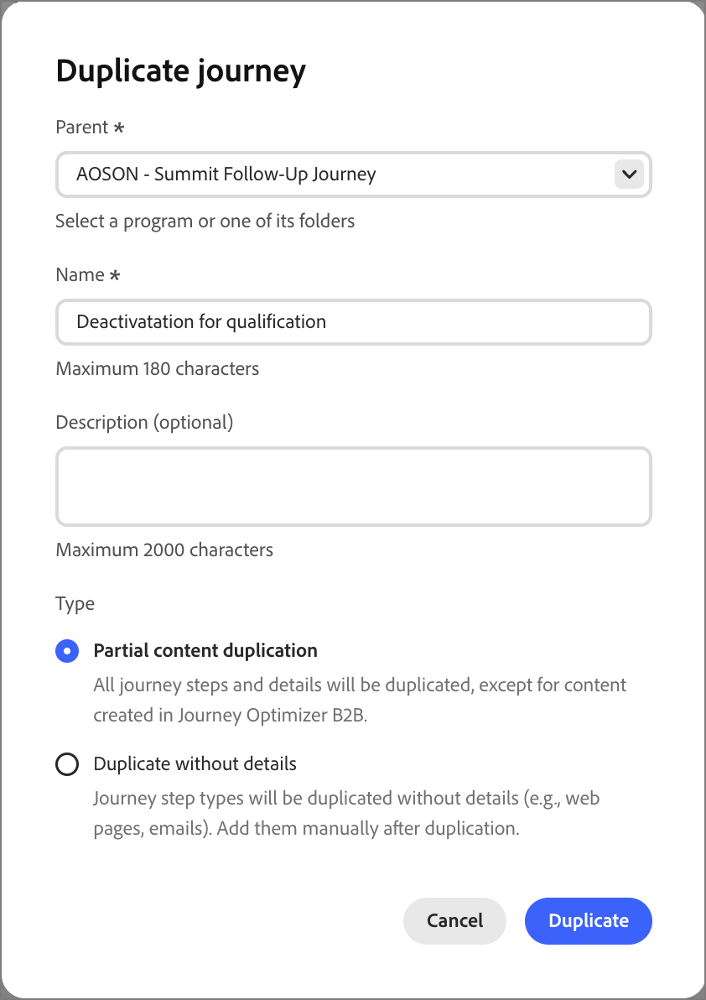

# ユーザージャーニー

[!DNL Adobe Marketo Optimizer]では、個人ジャーニーは、チャネルをまたいでパーソナライズされたエクスペリエンスを編成する、自動化されたマルチステップのリードベースのマーケティングプランです。 これらのジャーニーでは、Marketo Engageのデータを使用して、エンゲージメント、ビジネスイベント、スケジュールされたキャンペーンに応じたマーケティングプランを実施します。

>[!NOTE]
>
>各ジャーニーは、定義された[ プログラム ](./programs.md)内に存在します。 ジャーニーを作成する前に、親として使用するプログラムが少なくとも1つ必要です。

_新しいユーザーのジャーニーを構築するには&#x200B;:_

1. 個人ジャーニーの構築：
1. ノードを追加し、ジャーニーキャンバスでジャーニーフローを定義します。
1. [ジャーニーを公開します](#publish-a-journey)。

## ユーザーのジャーニーへのアクセスと参照 {#access-and-browse-person-journeys}

1. 左側のナビゲーションで、**[!UICONTROL マーケティング管理]**&#x200B;を展開します。

1. **[!UICONTROL マーケティング]**&#x200B;のリソースリストの右側で、**[!UICONTROL 人物ジャーニー]**&#x200B;を選択します。

   _人物ジャーニー_&#x200B;のリストは、メインワークスペースにタブ付きページとして表示されます。

   リストの上部にある&#x200B;_検索_ ツールにテキストを入力すると、表示されるリストを名前でフィルタリングできます。

   {width="800" zoomable="yes"}

1. リストツールを使用して、表示されるリストをカスタマイズします。

   * _フィルター_ （）アイコンをクリックして、ステータスでリストをフィルタリングします。
   * 表示される列を制御するには、「_テーブルをカスタマイズ_」（「」）アイコンをクリックします。
   * _列をリセット_ （）アイコンをクリックして、列幅をリセットします。

### ジャーニーリストの列 {#journey-list-columns}

ジャーニーリストページには、次の列が含まれます。

* [!UICONTROL 名前] （名前をクリックしてジャーニーキャンバスを開き、編集します）
* [!UICONTROL ステータス]
* [!UICONTROL 作成日]
* [!UICONTROL 作成者]
* [!UICONTROL 最終更新]
* [!UICONTROL 最終更新者]
* [!UICONTROL 公開日]
* [!UICONTROL 公開者]
* [!UICONTROL 開始日]
* [!UICONTROL 終了日]

列ヘッダーをクリックすると、リストを&#x200B;_[!UICONTROL ステータス]_、_[!UICONTROL 作成日]_、または&#x200B;_[!UICONTROL 最終更新]_&#x200B;で並べ替えることができます。 見出しの境界線をドラッグして、表示される列の幅を変更できます。 _テーブルをカスタマイズ_ ダイアログで、チェックボックスを選択またはクリアし、**[!UICONTROL 適用]**&#x200B;をクリックします。

### ジャーニーステータス {#journey-status}

ジャーニーのステータスは、適用したアクションに基づいて変更される場合があります。 ジャーニーのステータスに基づいて、ヘッダーの右側から特定のアクションを使用できます。

| ステータス | 説明 | 使用可能なアクション |
| ------ | ----------- | ----------------- |
| _**ドラフト**_ | 編集可能な非公開のジャーニー。 | [公開](#publish-a-journey)、[重複](#duplicate-a-journey)、[削除](#delete-a-journey) |
| _**ライブ**_ | ジャーニーを公開すると、ジャーニーのステータスが&#x200B;_ドラフト_&#x200B;から&#x200B;_ライブ_&#x200B;に変更されます。 この状態では、編集できなくなります。 | [重複](#duplicate-a-journey)、[新しいエントリに近い](#close-to-new-entries)、[中止](#abort-a-journey) |
| _**新規エントリに対してクローズ済み**_ | ジャーニーヘッダーの&#x200B;**[!UICONTROL 新しいエントリに閉じる]**&#x200B;をクリックすると、ジャーニーステータスが&#x200B;_ライブ_&#x200B;から&#x200B;_新しいエントリに閉じる_&#x200B;に変更されます。 | [重複](#duplicate-a-journey)、[中止](#abort-a-journey) |
| _**中止**_ | ジャーニーを中止すると、ジャーニーのステータスが&#x200B;_ライブ_&#x200B;または&#x200B;_新規エントリに対してクローズ済み_&#x200B;に変更されます。 中止したジャーニーは再開できません。 | [重複](#duplicate-a-journey)、[削除](#delete-a-journey) |
| _**終了**_ | ジャーニー内のすべての人物オーディエンスメンバーがジャーニーを完了すると、ステータスが&#x200B;_ライブ_&#x200B;または&#x200B;_クローズから新規エントリ_&#x200B;から&#x200B;_終了_&#x200B;に変更されます。 | [重複](#duplicate-a-journey)、[削除](#delete-a-journey) |

## 個人ジャーニーの作成 {#create-a-person-journey}

1. ジャーニーリストの右上にある「**[!UICONTROL ジャーニーを作成]**」をクリックします。

1. ダイアログで、人物ジャーニーの&#x200B;**[!UICONTROL 親]** プログラムを選択します。

1. 一意の&#x200B;**[!UICONTROL 名前]** （必須）と&#x200B;**[!UICONTROL 説明]** （オプション）を入力してください。

   {width="400"}

1. 「**[!UICONTROL 作成]**」をクリックします。

   ジャーニーキャンバスが開き、開始する人物オーディエンスノードが表示されます。

   {width="600" zoomable="yes"}

### ジャーニーヘッダー {#journey-header}

各ジャーニーキャンバスのヘッダーには、ジャーニー名、ステータス、スケジュールが含まれます。

{width="600" zoomable="yes"}

* 「_編集_」アイコン（）をクリックして、ジャーニー名または説明情報を変更します。
* 「**[!UICONTROL ジャーニー設定]**」をクリックして、ジャーニーの開始と繰り返しを変更します。
* **[!UICONTROL をクリック…ジャーニーアクションを適用するか、[ ジャーニートラフィック制御](./journey-traffic-control.md)を有効/無効にして再エントリするにはさらに]**&#x200B;個の操作が必要です。
* すべてのエラーが解決され、ジャーニーをアクティブ化する場合は、**[!UICONTROL 公開]**&#x200B;をクリックします。

### ジャーニーのデザイン {#journey-design}

_ジャーニーキャンバス_&#x200B;は、ジャーニーワークスペースの中央ゾーンです。 ジャーニーノードを追加して設定することができます。 ノードをクリックして、レイアウトの右側にあるパネルでプロパティを開き、デザインに応じて設定します。 ユーザージャーニーは常に[_[!UICONTROL 人物オーディエンス ]_ノード ](./person-audience-node.md)で始まり、ジャーニーの入力を定義できます。

個人ジャーニーを作成し、個人オーディエンスを定義したら、ノードを使用してジャーニーを構築します。 ジャーニーキャンバスでは、次のノードタイプを使用してマルチステップ B2B マーケティングのユースケースを構築し、ジャーニーを構築できるビジュアルデザイン空間を提供します。

* [アクションの実行](./action-nodes.md)
* [イベントをリッスン](./listen-for-event-nodes.md)
* [待機](./wait-nodes.md)
* [パスを分割](./split-merge-paths-nodes.md)
* [次に最適なパス](./next-best-path.md)
* [パスを結合](./split-merge-paths-nodes.md)

## ジャーニー管理 {#journey-management}

ジャーニーリストを開いて、ジャーニーのステータスを確認し、変更を加え、アクションを実行します。

### ジャーニーアクション {#journey-actions}

ジャーニーリストページには、Marketo Optimizer インスタンス内のすべての人物ジャーニーが含まれます。 リストページから、ジャーニーに複数のアクションを適用できます。

#### ジャーニーの公開 {#publish}

ブロッカーエラーがない場合は、ジャーニーを公開できます。 公開すると、ジャーニーのステータスが&#x200B;_ライブ_&#x200B;に変更されます。 ジャーニーにエラーがある場合、**[!UICONTROL 公開]** ボタンはメッセージ `Resolve errors before publishing`でグレー表示されます。

1. _[!UICONTROL 人物ジャーニー]_ リストからドラフトジャーニーを開きます。

1. ジャーニーキャンバスの右上にある「**[!UICONTROL 公開]**」をクリックします。

1. _[!UICONTROL ジャーニー設定を確認]_ ダイアログで、ジャーニー開始オプションを設定します。

   **[!UICONTROL ジャーニー設定]**&#x200B;でスケジュールを既に定義している場合は、設定を確認してください。

   ジャーニーのアクティベーションを設定する必要がある場合は、スケジュールタイプを選択します。

   * 公開時にジャーニーをアクティブにするには、**[!UICONTROL 即時]**&#x200B;を選択します。
   * 将来の日付でジャーニーをアクティブにするには、**[!UICONTROL 特定の日付]**&#x200B;を選択し、_カレンダー_ アイコンをクリックして日付を選択します。

1. 必要に応じて、ジャーニーの&#x200B;**[!UICONTROL 終了日]**&#x200B;を指定します。

   {width="400" zoomable="no"}

   開始日から最大3年間の期間を指定できます。 このフィールドは公開するために必要です。

1. 「**[!UICONTROL 次へ]**」をクリックします。

1. 確認ダイアログで、**[!UICONTROL 公開]**&#x200B;をクリックします。

#### ジャーニーを中止 {#abort-a-journey}

ライブジャーニーまたは将来の開始日にスケジュールされたジャーニーを中止（停止）すると、ジャーニーのユーザーは直ちに進行状況を停止し、ジャーニーのエントリはそれ以上発生しません。 中止したジャーニーは再開できません。

1. _[!UICONTROL ユーザーのジャーニー]_ リストからジャーニーを開きます。

1. **[!UICONTROL をクリック…右上に]**&#x200B;個を追加し、**[!UICONTROL Abort]**&#x200B;を選択します。

   {width="600" zoomable="yes"}

1. 確認ダイアログで、「**[!UICONTROL 中止]**」をクリックします。

#### 新規エントリに対してクローズ {#close-to-new-entries}

ライブジャーニーを新しいエントリにクローズすると、ジャーニー内の現在のユーザーはそのジャーニーのパスを継続し、それ以上ジャーニーのエントリは発生しません。 クローズしたジャーニーは再起動できません。 クローズしたジャーニーは複製できます。

1. _[!UICONTROL ユーザーのジャーニー]_ リストからジャーニーを開きます。

1. **[!UICONTROL をクリック…右上に]**&#x200B;個を追加し、**[!UICONTROL 新しいエントリに閉じる]**&#x200B;を選択します。

1. 確認ダイアログで、「**[!UICONTROL 新規エントリに対してクローズ]**」をクリックします。

#### ジャーニーの複製 {#duplicate-a-journey}

このアクションはクローン機能に似ていますが、複製したジャーニーに作成したジャーニーコンテンツアセットは含まれません。 ジャーニーの詳細を複製することも、フローとパス構造の単純なスケルトンを複製することもできます。

1. _[!UICONTROL 人のジャーニー]_ リストで、ジャーニー名の横にある&#x200B;_詳細_ アイコン （**...**）をクリックし、**[!UICONTROL 重複]**&#x200B;を選択します。

   {width="400"}

   ジャーニーのステータスに応じて、ジャーニーの詳細またはジャーニーキャンバスから重複アクションにアクセスすることもできます。

   * ドラフトジャーニーの場合、**[!UICONTROL をクリックします…右上に]**&#x200B;個を追加し、**[!UICONTROL 複製]**&#x200B;を選択します。
   * その他のすべてのジャーニーのステータスについては、右上の「**[!UICONTROL 複製]**」をクリックします。

1. ダイアログで、複製されたジャーニーの&#x200B;**[!UICONTROL 親]** プログラムを選択します。

1. 一意の&#x200B;**[!UICONTROL 名前]** （必須）と&#x200B;**[!UICONTROL 説明]** （オプション）を入力してください。

   デフォルトでは、ダイアログには元のジャーニーの名前と`_copy`が追加されています。 必要に応じて、ジャーニーの別の一意の名前を入力します。

   {width="370"}

1. 複製の&#x200B;**[!UICONTROL タイプ]**&#x200B;を選択します。

   * **[!UICONTROL 部分的なコンテンツの複製]** - 作成したメールや SMS メッセージを除く、ジャーニー内のすべてをコピーするには、このタイプを使用します。 Marketo Engage のメールまたは SMS メッセージを参照するノードは、完全にそのまま残ります。

   * **[!UICONTROL 詳細なしで複製]** – このタイプを使用して、ノード構造とパスのみをコピーします。 すべてのノード設定とパス条件は未定義（デフォルト）なので、異なるオーディエンス、アクション、パスセグメント化設定で基本フローを再利用できます。 すべての待機ノードでは、デフォルトの5日間が使用されます。

1. 「**[!UICONTROL 複製]**」をクリックします。

   複製されたジャーニーがジャーニーキャンバスで開き、必要に応じてジャーニーコンテンツの詳細を設定および作成できます。

#### ジャーニーの削除 {#delete-a-journey}

ジャーニーを完全に削除するには、削除アクションを使用します。 今後の開始日にスケジュールされたライブジャーニーまたはジャーニーは削除できません。

>[!WARNING]
>
>ジャーニーの削除は永続的であり、元に戻すことはできません。

1. _[!UICONTROL 人物ジャーニー]_ リストで、ジャーニー名の横にある&#x200B;_詳細_ アイコン （**...**）をクリックし、**[!UICONTROL 削除]**&#x200B;を選択します。

   ジャーニーのステータスに応じて、ジャーニーヘッダーから削除アクションにアクセスすることもできます。

   * ドラフトジャーニーの場合、**[!UICONTROL をクリックします…右上に]**&#x200B;個を追加し、**[!UICONTROL 削除]**&#x200B;を選択します。
   * _完了_&#x200B;や&#x200B;_中止_&#x200B;など、その他のジャーニーのステータスについては、右上の「**[!UICONTROL 削除]**」をクリックします。

1. 確認ダイアログで、「**[!UICONTROL 削除]**」をクリックします。
