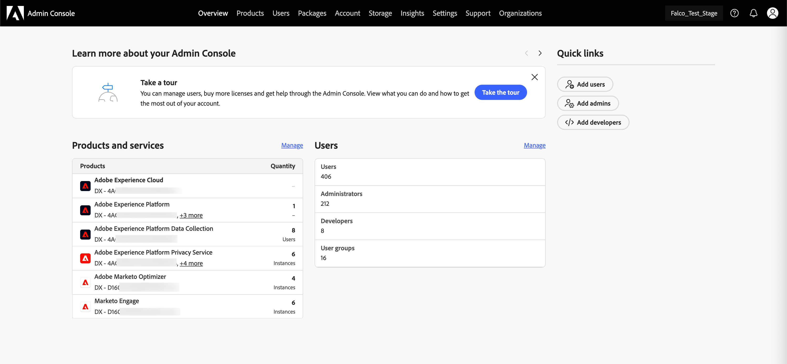
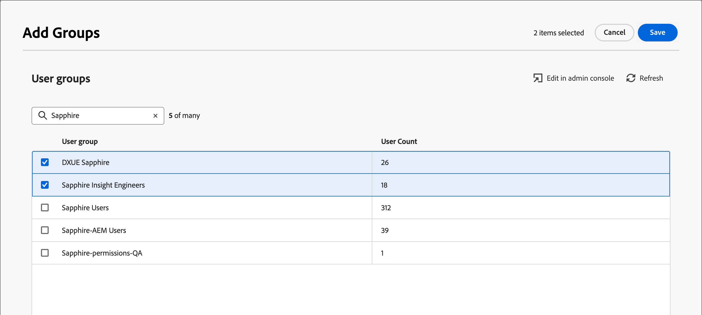

# ユーザーのアクセスと権限

プロビジョニングが完了し、サンドボックスがバインドされたら、次の手順を実行して、チームとユーザーに[!DNL Marketo Optimizer] アクセスを提供します。

1. [Admin Consoleで [!DNL Journey Optimizer B2B Edition] 製品プロファイル &#x200B;](#create-profile)を作成します（1回限り/初期設定のみ）。
1. Admin Consoleで [&#x200B; ユーザーグループを追加 &#x200B;](#add-user-group) します。
1. [製品プロファイル &#x200B;](#assign-profile)をAdmin Consoleのユーザーグループに割り当てます。
1. [Admin Consoleの新しいグループ &#x200B;](#add-users)にユーザーを追加します。
1. [&#x200B; ビルトインロールを編集](#edit-role-permissions)または[Adobe Experience Platformで[!DNL Journey Optimizer B2B Edition]権限を持つカスタムロール &#x200B;](#create-a-custom-role)を作成します。
1. [Adobe Experience Platformのロールにユーザー](#add-users-to-a-role)または[&#x200B; グループ &#x200B;](#add-user-groups-to-a-role)を追加します。

## 製品プロファイルの設定 {#config-profile}

管理者は、Adobe製品のライセンスとユーザーを一元的に管理する[!DNL Adobe Admin Console]でこれらのタスクを実行できます。 Admin Console では、様々な個別のソリューション内ではなく、1 か所でユーザーを作成および管理できます。 その機能と機能について詳しくは、[Admin Consoleの概要](https://helpx.adobe.com/business/enterprise/plan-your-deployment/basic-concepts/admin-console.html) ページを参照してください。

### Admin Console へのアクセス {#admin-console}

Admin Consoleを使用してチーム内のユーザーを管理する前に、Admin Consoleにアクセスでき、適切な権限を持っていることを確認する必要があります。

1. システム管理者は、オンボーディングプロセスの一環として Adobe から複数のメールを受信します。

   アクセス権が付与された組織名に関する情報を提供するウェルカムメールを探します。

1. お知らせメールの **[!UICONTROL 使用を開始]** リンクをクリックして、Admin Consoleに移動します。

   メールが見つからない場合は、ブラウザーを開いてAdmin Console（[https://adminconsole.adobe.com](https://adminconsole.adobe.com)）に直接アクセスします。

1. Adobe IDを使用してログインします。

   ログインに成功すると、Adobe Admin Consoleの _概要_ ページが表示されます。

1. 複数の組織にアクセスできる場合は、正しい組織にログインしていることを確認します。

   組織を変更するには、右上隅の組織名をクリックし、アクセスが必要な組織を選択します。

1. **[!UICONTROL ユーザー]** カードから _[!UICONTROL 管理者]_ を選択して、自分がシステム管理者であることを確認します。

   {width="800" zoomable="yes"}

1. Adobe IDのメールアドレス、ユーザー名、名、姓を入力して検索します。

   * アクセス権が正しく設定されている場合、検索結果に自分のレコードが表示されます。

   * **[!UICONTROL 管理者の役割]** 列の値に `System` が表示されている場合、自分（または表示されているユーザー）がシステム管理者であることがわかります。

### [!DNL Journey Optimizer B2B Edition]製品プロファイルの作成 {#create-profile}

Adobe ソリューションに対するアクセス権をユーザーに付与する場合、必ずしも完全なアクセス権を付与する必要はありません。 製品プロファイルを使用すると、ソリューションごとに独自のユーザー権限を設定できます。 Admin Consoleを使用して製品プロファイルを割り当てます。

ユーザーの使用権限に製品プロファイルを使用する方法について詳しくは、Admin Console ドキュメントの [_エンタープライズユーザーの製品プロファイルの管理_](https://helpx.adobe.com/business/enterprise/manage-products-and-entitlements/manage-products-and-product-profiles/manage-product-profiles.html){target="_blank"} を参照してください。

{width="30"} システム管理者または[!DNL Experience Platform]製品管理者は、[https://adminconsole.adobe.com](https://adminconsole.adobe.com)から次の手順を実行できます。

1. 「**[!UICONTROL 製品]**」タブを選択します。

1. プロファイルを追加する[!DNL Journey Optimizer B2B Edition] インスタンスを開き、**[!UICONTROL 新しいプロファイル]**&#x200B;をクリックします。

   {width="600" zoomable="yes"}の製品プロファイル

1. 製品プロファイル名（「_B2B ユーザー_」など）を入力します。

1. **[!UICONTROL 次へ]** をクリックしてから **[!UICONTROL 保存]** をクリックします。

### ユーザーグループの追加 {#add-user-group}

ユーザーグループは、共有された一連の権限を付与されたユーザーのコレクションです。 ユーザーグループのユーザーを追加または削除できます。 グループの権限は、グループ内のユーザーが変更されても、同じままです。

ユーザーグループを使用して権限を管理する方法について詳しくは、Admin Console ドキュメントの [&#x200B; ユーザーグループの管理 &#x200B;](https://helpx.adobe.com/business/enterprise/manage-users/user-groups.html){target="_blank"} を参照してください。

{width="30"} システム管理者は、[https://adminconsole.adobe.com](https://adminconsole.adobe.com)から次の手順を実行できます。

1. 「**[!UICONTROL ユーザー]**」タブを選択します。

1. 左側のナビゲーションで **[!UICONTROL ユーザーグループ]** を選択します。

1. 右上で **[!UICONTROL 新規ユーザーグループ]** をクリックします。

1. _B2B ユーザー_&#x200B;など、ユーザーグループの名前を入力し、**[!UICONTROL 保存]**&#x200B;をクリックします。

   {width="600" zoomable="yes"}

### 製品プロファイルの割り当て {#assign-profile}

{width="30"}製品管理者は、[https://adminconsole.adobe.com](https://adminconsole.adobe.com)から次の手順を実行できます。

1. 作成したユーザーグループをクリックします。

1. 「**[!UICONTROL 割り当てられた製品プロファイル]**」タブを選択し、「**[!UICONTROL プロファイルを割り当て]**」をクリックします。

1. 「**+**」をクリックして、次の製品の各インスタンスを追加します。

   * [!UICONTROL Adobe Journey Optimizer B2B edition - ユーザープロファイル &#x200B;]
   * [!UICONTROL Adobe Experience Platform - AEP-Default-All-Users]
   * [!UICONTROL Adobe Experience Platform Data Collection - Default Data Collection All Access]
   * [!UICONTROL Adobe Experience Platform - デフォルトの実稼動環境のすべてのアクセス &#x200B;]

   {width="600" zoomable="yes"}の製品プロファイル

1. 「**[!UICONTROL 保存]**」をクリックします。

### 新しいグループにユーザーを追加 {#add-users}

ユーザー管理について詳しくは、Admin Console ドキュメントの&#x200B;[_Adobe Admin Console ユーザー_](https://helpx.adobe.com/business/enterprise/manage-users/users.html){target="_blank"}を参照してください。

{width="30"} システム管理者または製品管理者は、[https://adminconsole.adobe.com](https://adminconsole.adobe.com)から次の手順を実行できます。 製品管理者は、組織に既に存在するユーザーのみを追加できます。

1. ユーザーがまだ組織のメンバーではない場合は、各ユーザーを追加します。

   * _[!UICONTROL クイック リンク]_ の下の [**[!UICONTROL ユーザーの追加]**] をクリックします。

   * ユーザーの電子メールアドレスを入力し、**[!UICONTROL 新しいユーザーとして追加]**&#x200B;をクリックします。

     {width="600" zoomable="yes"}

   * 名と姓を入力し、**[!UICONTROL 保存]**&#x200B;をクリックします。

1. 各ユーザーをグループに追加します。

   * ユーザー名をクリックします。

   * ユーザーの詳細ページで、**[!UICONTROL ユーザーグループ]**&#x200B;までスクロールします。

   * 左側の&#x200B;_詳細_ （**...**）アイコンをクリックし、**[!UICONTROL ユーザーグループの編集]**&#x200B;を選択します。

   * **[!UICONTROL ユーザーグループ]**&#x200B;の下にある&#x200B;_追加_ （**+**）アイコンをクリックします。

     {width="600" zoomable="yes"}のユーザーグループを選択

   * 以前に作成したユーザーグループを選択し、**[!UICONTROL 適用]**&#x200B;をクリックします。

   * ユーザーの変更については、**[!UICONTROL 保存]**&#x200B;をクリックします。

## 製品の権限の割り当て {#assign-product-permissions}

権限は、製品プロファイルに割り当てる許可を定義できる単一の権利です。 各権限は、個人のジャーニーやコンテンツなどの機能の下にグループ化され、[!DNL Marketo Optimizer]の機能を表します。

Adobe Experience Platformの _権限_ 領域では、管理者は、ユーザーの役割とアクセスポリシーを定義して、製品アプリケーション内の機能とオブジェクトのアクセス権限を管理できます。 このアプリでは、役割を作成および管理すると共に、それらの役割に対して必要なリソース権限を割り当てることができます。 また、権限では、特定の役割に関連付けられたサンドボックスとユーザーを管理することもできます。

Experience Platformのロール権限について詳しくは、Experience Platform ドキュメントの [&#x200B; ロールの権限の管理 &#x200B;](https://experienceleague.adobe.com/en/docs/experience-platform/access-control/abac/permissions-ui/permissions){target="_blank"} を参照してください。

1. [experience.adobe.com](https://experienceleague.adobe.com/ja) に移動します。

1. _[!UICONTROL クイックアクセス]_ パネルで、「**[!UICONTROL 権限]**」を選択します。

   >[!NOTE]
   >
   >_[!UICONTROL 権限]_ が表示されない場合は、「**[!UICONTROL すべて表示]**」をクリックし、使用可能なアプリケーションから選択する必要がある場合があります。

   {width="700" zoomable="yes"}

### 権限 {#permissions}

次の権限は、[!DNL Marketo Optimizer]のチャネル設定、コンテンツ管理、およびユーザーのジャーニー機能へのアクセスを制御します。

| カテゴリ | 権限 | 説明 |
| -------- | ----------- | ---------- |
| B2B チャネル設定 | B2B メール設定の表示 | メール設定（サブドメイン、PTR レコード、IP プール、抑制リスト、シードリスト、IP ウォームアッププラン）を表示します。 |
| | B2B メール設定の管理 | メール設定（サブドメイン、PTR レコード、IP プール、抑制リスト、シードリスト、IP ウォームアッププラン）を設定します。 これらの設定は、ユーザーがメールを送信する前に必要です。 |
| | B2B チャネル設定の管理 | 左側のナビゲーションおよびすべてのチャネル設定操作の&#x200B;_チャネル_ メニュー項目にアクセスします。 |
| | B2B WhatsApp プリセットの管理 | WhatsApp メッセージプリセットと関連するSMS設定を作成、表示、削除します。 |
| B2B ジャーニー | B2B人物ジャーニーの管理 | _人物ジャーニー_ リストとすべての人物ジャーニー操作にアクセスします。 |
| B2B Assets | コンテンツテンプレートを表示 | コンテンツテンプレートのリストと詳細を表示します。 |
| | B2B テンプレートの管理 | コンテンツテンプレートを作成、編集、削除します。 |
| | B2B フラグメントの表示 | コンテンツフラグメントのリストと詳細を表示します。 |
| | B2B フラグメントの管理 | コンテンツフラグメントを作成、編集、削除します。 |
| | B2B フラグメントの公開 | テンプレート、メール、ランディングページで使用するコンテンツフラグメントを公開します。 |
| | B2B Assetsを見る | Assets ライブラリとアセットファイルの詳細を表示します。 |
| | B2B Assetsの管理 | アセットファイルを作成、編集、削除します。 |
| | B2B メールの表示 | 電子メールメッセージの表示。 |
| | B2B メールの管理 | メールメッセージの作成、編集、削除。 |
| | B2B メッセージ書き出しの管理 | 「メール」セクションでメッセージレポートを書き出します。 |
| Journey Optimizer ライブラリ | B2B ライブラリアイテムの管理 | ライブラリに保存されたエクスプレッションを追加および削除します。 |
| データガバナンス | B2B削除使用ラベルの管理 | データセットとスキーマに適用されたデータ使用ラベル（DULE）を表示、作成、削除します。 |
| サンドボックス管理 | B2B パッケージの管理 | サンドボックスパッケージを作成、書き出し、読み込み、コピー、削除します。 |

[!DNL Marketo Optimizer]の外部宛先のサポートを提供するには、次の権限が必要です。

| カテゴリ | 権限 | 説明 |
| -------- | ----------- | ---------- |
| ダッシュボード | 標準ダッシュボードを表示 | _プロファイル_、_宛先_、_セグメント_ ダッシュボードへの表示専用アクセス。 左側のナビゲーションの&#x200B;_ダッシュボード_&#x200B;と「_ダッシュボード_ インベントリと統合」タブへのアクセスも有効にします。 |
| | 標準ダッシュボードの管理 | Data Warehouse にないカスタム属性の追加。 |
| 宛先 | 宛先の表示 | _カタログ_ タブで利用可能な宛先を表示し、_参照_ タブで認証済みの宛先を表示するための表示専用アクセス権。 |
| | 宛先の管理 | 宛先の接続と宛先アカウントを表示、作成、削除します。 |
| | 宛先のアクティブ化 | アクティブな配信先へのデータのアクティベーション。 この関数にアクセスするには、_宛先の表示_&#x200B;または&#x200B;_宛先の管理_&#x200B;も必要です。 |
| | マッピングなしでセグメントをアクティブ化 | マッピング手順を表示せずに、既存の宛先にオーディエンスをアクティベートできます。 ユーザーは、アクティベーションワークフローでオーディエンスを追加および削除できますが、マッピングされた属性や ID を追加または削除することはできません。 この関数にアクセスするには、_宛先を表示_&#x200B;権限も必要です。 |
| | データセット宛先の管理とアクティブ化 | データセットのエクスポートフローを表示、作成、編集、無効化したり、アクティブなデータセットにデータをアクティベートしたりできます。 この関数にアクセスするには、_宛先を表示_&#x200B;権限も必要です。 |
| | 宛先オーサリング | Adobe Experience Platform Destination SDKを使用して宛先を作成する機能。 |
| データガバナンス | データ使用ポリシーの表示 | 組織に属するデータ使用ポリシーの表示専用アクセス。 |
| | データ使用ポリシーの管理 | データ使用ポリシーの表示、作成、編集、削除。 |
| データ取り込み | ソースの表示 | _カタログ_ タブの利用可能なソースと&#x200B;_参照_ タブの認証済みソースへの表示専用アクセス。 |
| | ソースの管理 | ソースの表示、作成、編集、および無効化。 |
| プロファイル管理 | プロファイル設定の表示 | すべてのプロファイル設定への表示専用アクセス。 |
| | プロファイル設定の管理 | すべてのプロファイル設定を表示および編集します。 |

<!--

### B2B built-in roles {#b2b-built-in-roles}

When your organization has [!DNL Journey Optimizer B2B Edition] provisioned, Experience Platform includes a set of built-in (default) roles that you can use to manage access to the product capabilities:

| Role | Permissions |
| ---- | ----------- |
| B2B Journey Manager | <li>Manage B2B Journeys <li>Manage B2B Buying Groups <li>Manage B2B Account Lists <li>View B2B Engagement Dashboard <li>View B2B Insights Dashboard |
| B2B Channel Manager | <li>Manage B2B Assets <li>Manage B2B Templates <li>Manage B2B Fragments |
| B2B System Administrator | <li>Manage B2B Channels Configurations <li>Manage B2B Admin Configurations |
| B2B Sales User | <li>View B2B Engagement Dashboard <li>View B2B Buying Groups <li>Access In-CRM Insights |

-->

### 役割の権限の編集 {#edit-role-permissions}

組み込みの役割またはカスタムの役割の場合は、いつでも権限を追加または削除できます。 デフォルトまたはカスタムの役割を変更すると、その役割に割り当てられたすべてのユーザーに影響します。

>[!IMPORTANT]
>
>[!DNL Marketo Optimizer] アクセスするには、次の命名規則を使用してプロビジョニングされた特定のサンドボックスを有効にする必要があります：Marketo Engage サブスクリプション プレフィックス + Prime。 例えば、リンクされたMarketo Engage サブスクリプションのプレフィックスが&#x200B;_AcmeAssoc_&#x200B;の場合、[!DNL Marketo Optimizer] アクセスに必要なサンドボックスは&#x200B;_AcmeAssocPrime_&#x200B;です。

>[!NOTE]
>
>Admin Consoleのシステム管理者は、これらの手順を実行できます。

役割のアクセス許可を変更するには（_T） :_

1. 左側のナビゲーションで「**[!UICONTROL 役割]**」を選択します。

1. **_B2B チャネルマネージャー_** の役割名をクリックします。

1. 詳細ページで、右上の **[!UICONTROL 編集]** をクリックします。

   {width="800" zoomable="yes"}

   役割エディターの&#x200B;_[!UICONTROL リソース]_ メニューには、Experience Cloud - Platformを利用したアプリケーションに適用されるリソースのリストが表示されます。

1. [!DNL Marketo Optimizer] アクセス用にプロビジョニングされたサンドボックス （`<Marketo subscription prefix>Prime`）を選択します。

   {width="800" zoomable="yes"}

1. 各B2B リソースの&#x200B;_Add_ アイコン （**+**）をクリックします。

   {width="700" zoomable="yes"}

1. 各リソースの特定の権限を追加するか、**[!UICONTROL すべてを追加]**&#x200B;を選択します。

1. 「**[!UICONTROL 保存]**」をクリックします。

   <!-- {width="700" zoomable="yes"} -->

1. 「**[!UICONTROL 閉じる]**」をクリックして詳細ページに戻ります。

### 役割にユーザーを追加 {#add-users-to-a-role}

{width="30"} システム管理者またはExperience Platform管理者は、次の手順を実行できます。

1. 役割の詳細を開き、「**[!UICONTROL ユーザー]**」タブを選択します。

   このタブには、役割に割り当てられたすべてのユーザーのリストが表示されます。

1. **[!UICONTROL ユーザーを追加]** をクリックします。

   {width="800" zoomable="yes"}

1. _[!UICONTROL ユーザーを追加]_ ダイアログで、役割に追加するユーザーを見つけて選択します。

   * 検索ツールを使用して、ユーザーのリストをフィルタリングできます。

   * 各ユーザーのチェックボックスを選択します。

   {width="600" zoomable="yes"}

1. 追加するすべてのユーザーを選択したら、「**[!UICONTROL 保存]**」をクリックします。

### 役割へのユーザーグループの追加 {#add-user-groups-to-a-role}

ユーザー管理について詳しくは、Admin Console ドキュメントの&#x200B;[_Adobe Admin Console ユーザー_](https://helpx.adobe.com/business/enterprise/manage-users/users.html){target="_blank"}を参照してください。

{width="30"} システム管理者またはExperience Platform管理者は、次の手順を実行できます。

1. 役割の詳細を開き、「**[!UICONTROL ユーザーグループ]**」タブを選択します。

   このタブには、役割に割り当てられたすべてのユーザーグループのリストが表示されます。

1. **[!UICONTROL グループを追加]** をクリックします。

   {width="800" zoomable="yes"}

1. _[!UICONTROL グループを追加]_ ダイアログで、役割に追加するグループを見つけて選択します。

   * 検索ツールを使用して、ユーザーグループのリストをフィルタリングできます。

   * 各ユーザーグループのチェックボックスを選択します。

   {width="600" zoomable="yes"}

1. 追加するすべてのグループを選択したら、**[!UICONTROL 保存]**&#x200B;をクリックします。

### カスタムのロールを作成 {#create-a-custom-role}

{width="30"} システム管理者またはExperience Platform管理者は、次の手順を実行できます。

1. 左側のナビゲーションで「**[!UICONTROL 役割]**」を選択し、「**[!UICONTROL 役割を作成]**」を選択します。

1. _[!UICONTROL 新しい役割の作成]_ ダイアログで、「_B2B マーケター_」などの役割の名前と説明（オプション）を入力します。

1. 「**[!UICONTROL 確認]**」をクリックします。

1. [!DNL Marketo Optimizer] アクセス用にプロビジョニングされたサンドボックス （`<Marketo subscription prefix>Prime`）を選択します。

   {width="800" zoomable="yes"}

1. B2B 製品の権限を追加します。

   役割に必要な製品機能を決定するには、[製品権限](#permissions)のリストを参照してください。

   左側の&#x200B;_[!UICONTROL リソース]_ リストで、B2B アイテムを見つけ、_追加_ （**+**）アイコンをクリックして、役割に対して有効にする各属性を追加します。

   検索ツールに&#x200B;_B2B_&#x200B;と入力すると、多くのB2B製品権限のリストをフィルタリングできます。

   {width="700" zoomable="yes"}

1. 右上の **[!UICONTROL 保存]** をクリックします。

1. 役割の詳細に移動し、「**[!UICONTROL ユーザーグループ]**」タブを選択します。

1. **[!UICONTROL グループを追加]** をクリックします。

1. Admin Consoleで以前に作成したユーザーグループの横にあるチェックボックスをオンにします。

1. 「**[!UICONTROL 保存]**」をクリックします。

カスタムの役割が設定され、割り当てられたグループのユーザーは、選択した[!DNL Marketo Optimizer]機能にアクセスできるようになりました。
